# System Architecture

## High-Level Architecture

Alia-bot follows an **event-driven architecture** built on Discord.js with three primary execution paths: slash commands, message responses, and event handlers.

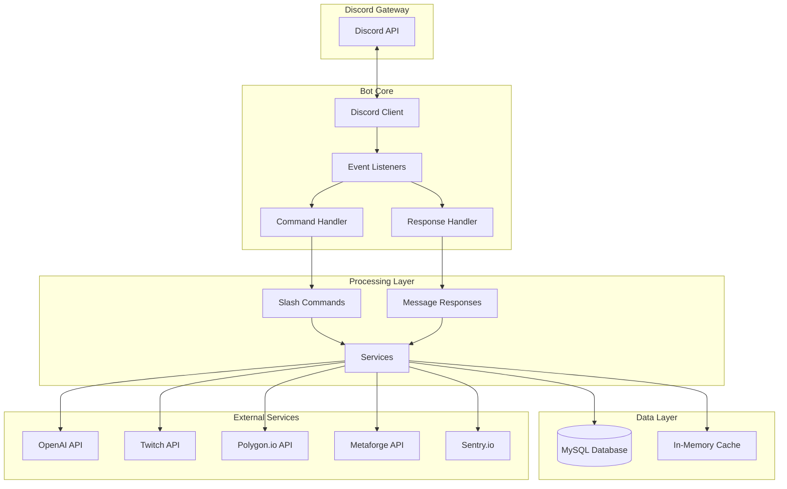

## Application Layers

### Layer 1: Entry Point (`index.ts`)

The main entry point initializes the Discord client, connects to the database, and sets up the shared Context object.

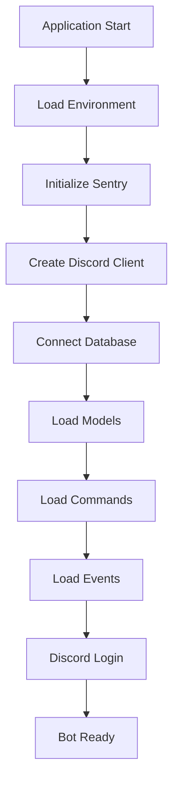

**Key Responsibilities:**
- Discord client initialization with required intents
- Sequelize database connection and sync
- Dynamic loading of commands and events
- Creation of shared Context object
- Global error handlers (uncaughtException, unhandledRejection)
- Graceful shutdown handling (SIGINT, SIGTERM)

### Layer 2: Event Handlers (`events/`)

Discord.js events are routed to corresponding handler files.

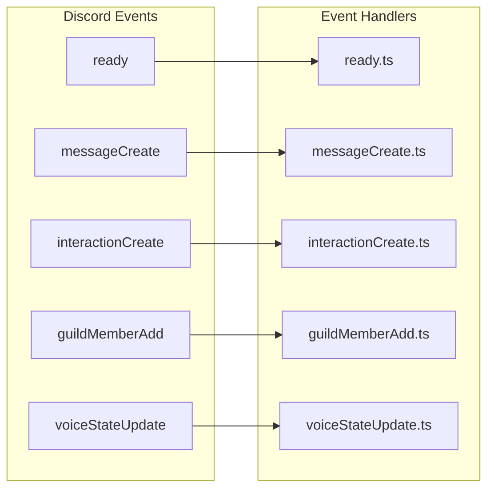

### Layer 3: Command System (`src/commands/`)

Slash commands are registered with Discord and executed via interactionCreate events.

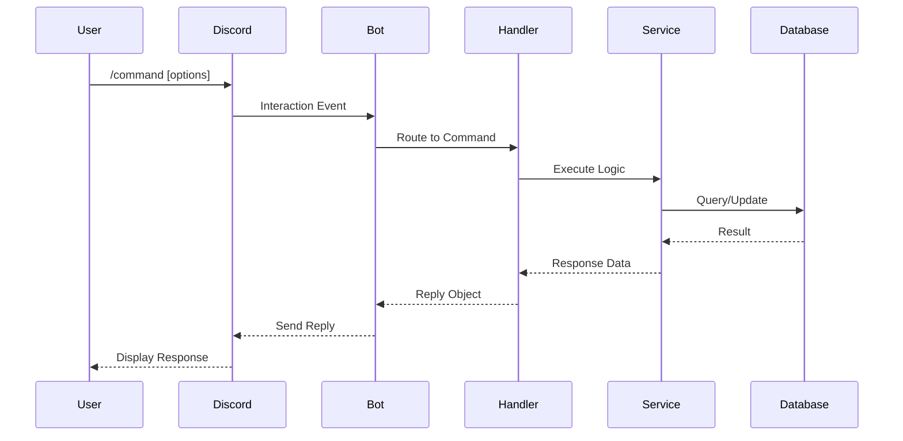

### Layer 4: Response System (`src/responses/`)

Message responses are processed through a priority-based chain.

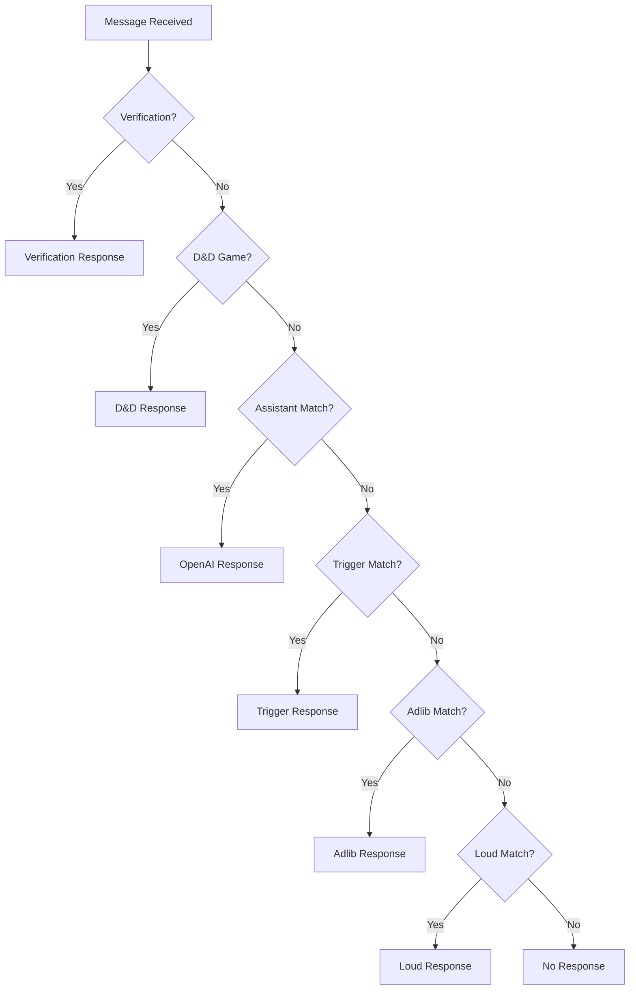

## Design Patterns

### 1. Context Pattern

A shared `Context` object is passed through all handlers, providing access to:

```typescript
interface Context {
    tables: {          // Sequelize models
        Adlibs: Model;
        Config: Model;
        Louds: Model;
        // ... 21 models total
    };
    log: BunyanLogger;      // Structured logging
    sequelize: Sequelize;   // Database connection
    VERSION: string;        // Bot version
    voiceService: VoiceService;
    motivationalScheduler: MotivationalScheduler;
    sparksService: SparksService;
}
```

### 2. Event-Driven Architecture

Discord events trigger file-based handlers automatically:

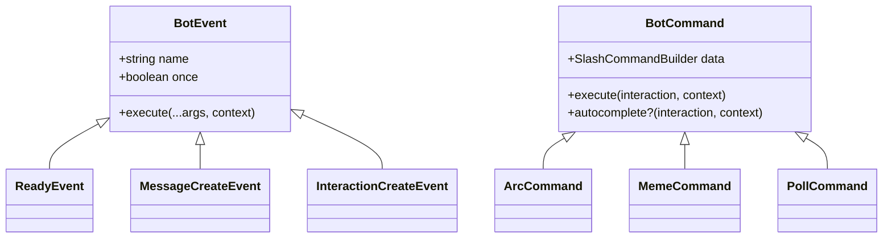

### 3. Factory Pattern for Models

Database models are initialized through factory functions:

```typescript
// Model Factory Pattern
export default function(sequelize: Sequelize): ModelCtor<Model> {
    return sequelize.define('ModelName', schema, options);
}
```

### 4. Singleton Services

Services are instantiated once at startup and shared:

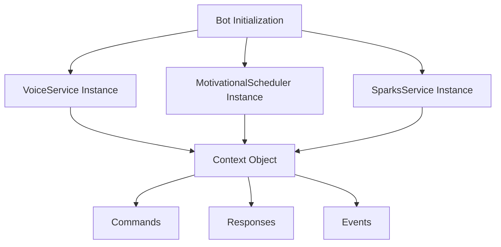

### 5. Priority Chain Pattern

Message responses use a priority chain where first match wins:

```typescript
const responsePriority = [
    { name: 'verification', handler: verificationResponse },
    { name: 'dnd', handler: dndResponse },
    { name: 'assistant', handler: assistantResponse },  // OpenAI
    { name: 'triggers', handler: triggerResponse },
    { name: 'adlibs', handler: adlibsResponse },
    { name: 'louds', handler: loudsResponse },
];
```

## Module Architecture

### Command Module Structure

```
src/commands/
├── arc.ts              # Arc Raiders integration
├── meme.ts             # Meme generation
├── poll.ts             # Interactive polls
├── dnd.ts              # D&D game system
├── speak.ts            # Voice TTS
└── ...                 # 51 commands total
```

Each command exports:
```typescript
export const data = new SlashCommandBuilder()
    .setName('command-name')
    .setDescription('Command description');

export async function execute(
    interaction: ChatInputCommandInteraction,
    context: Context
): Promise<void>;

export async function autocomplete?(
    interaction: AutocompleteInteraction,
    context: Context
): Promise<void>;
```

### Service Module Structure

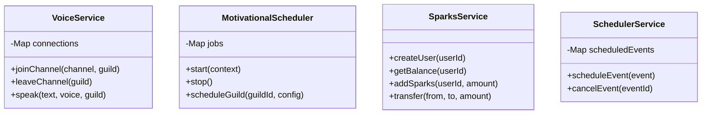

## Data Flow

### Command Execution Flow

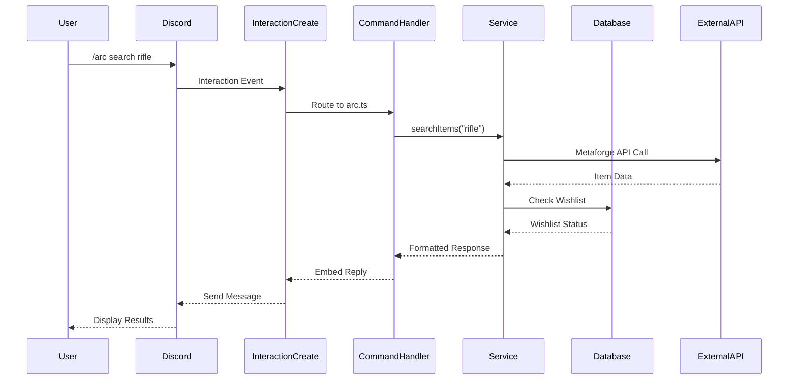

### NLP Response Flow

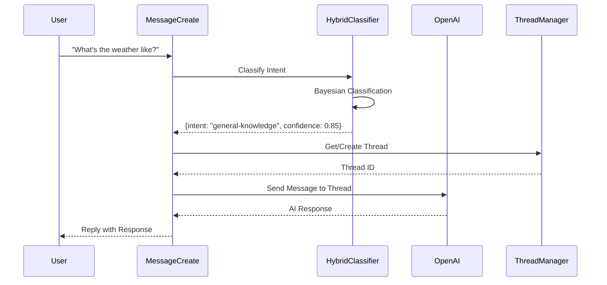

## Error Handling Architecture

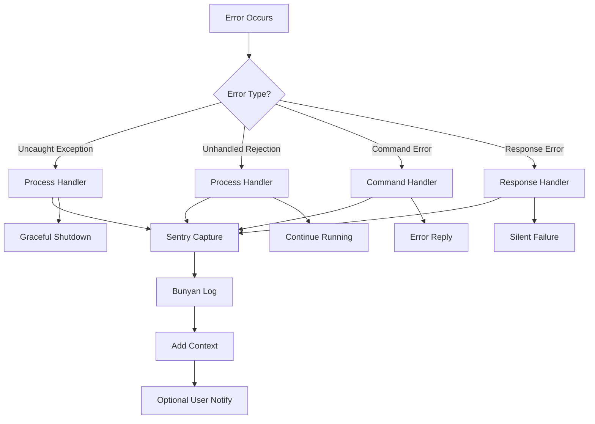

## Deployment Architecture

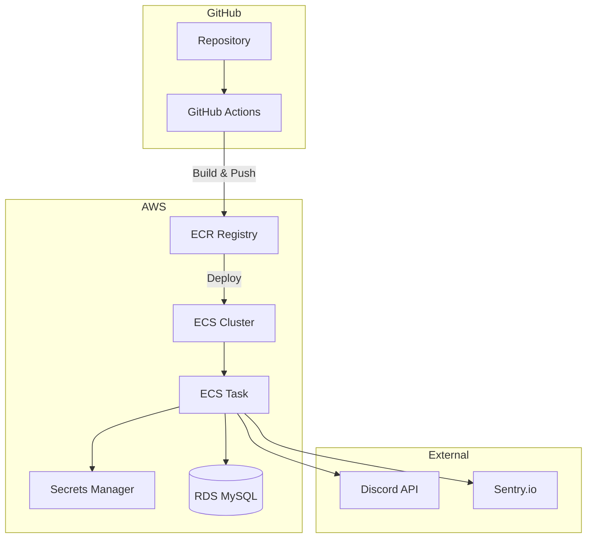

## Security Architecture

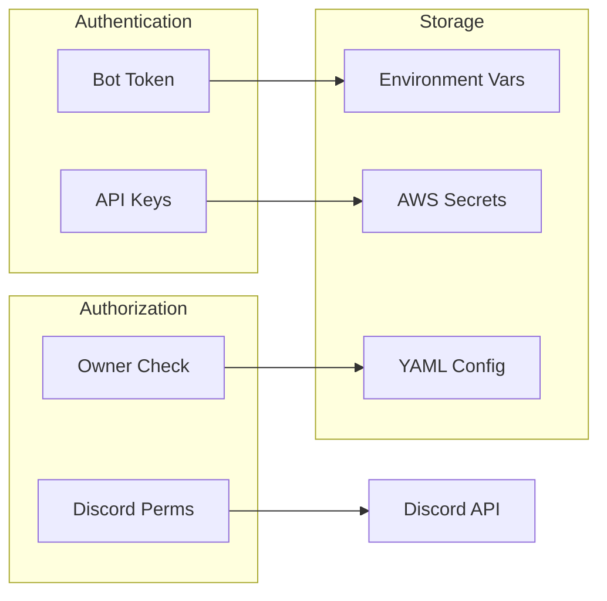
