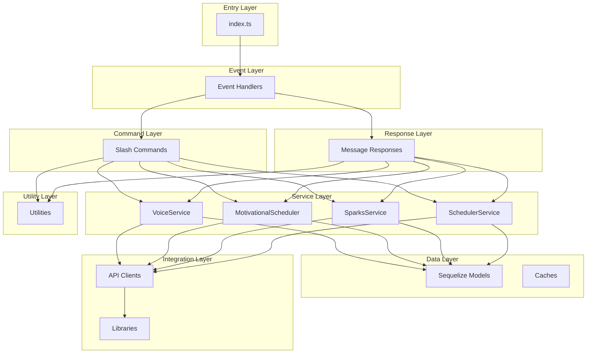
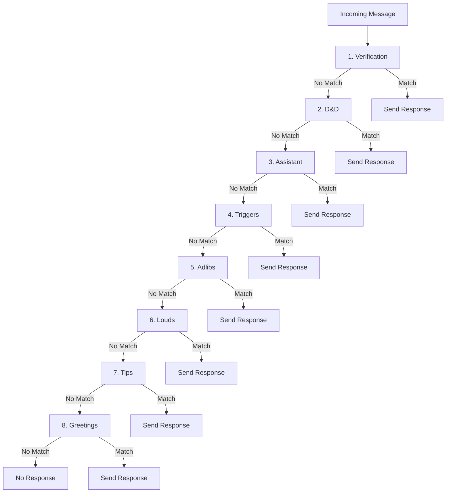
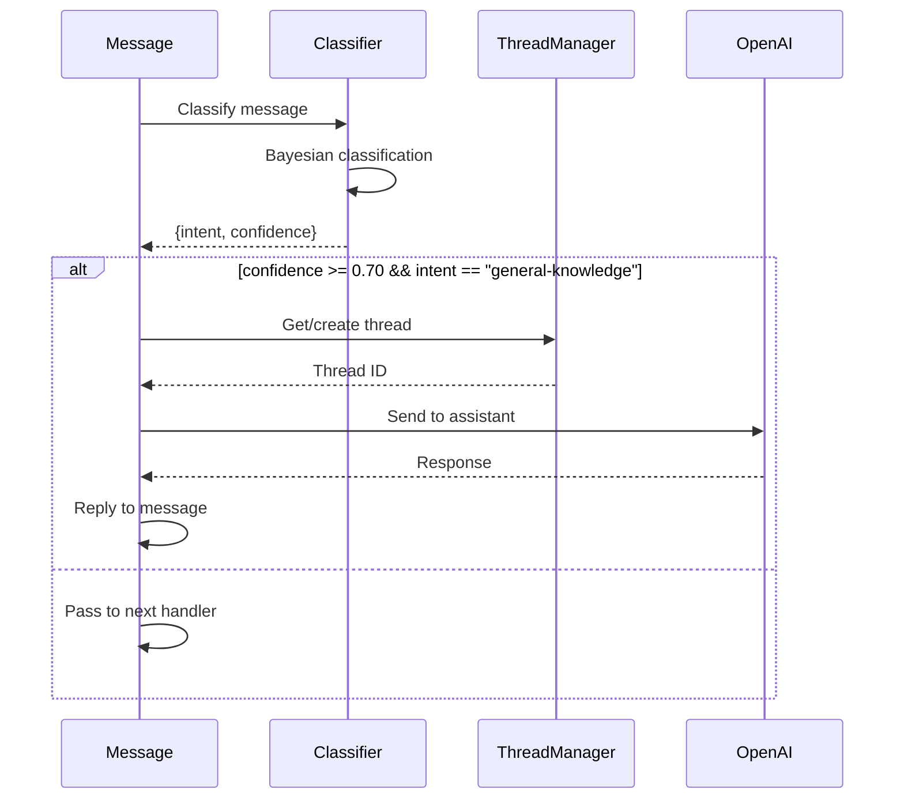
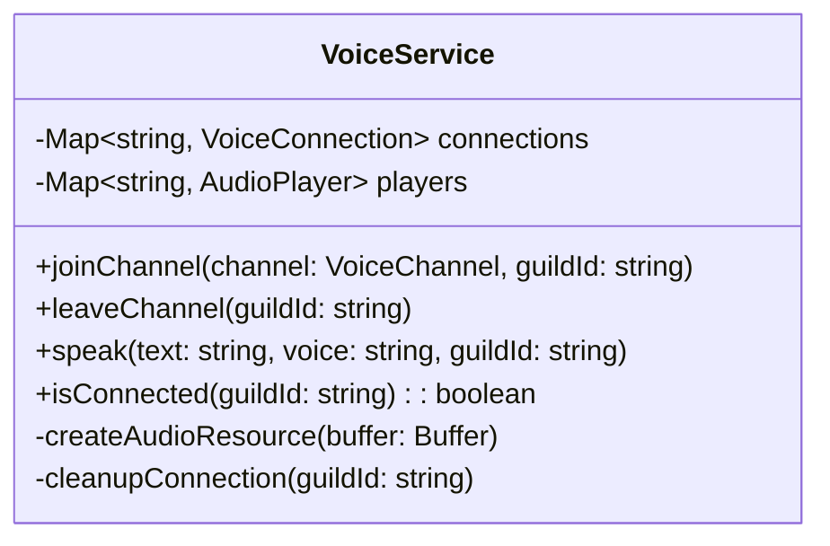
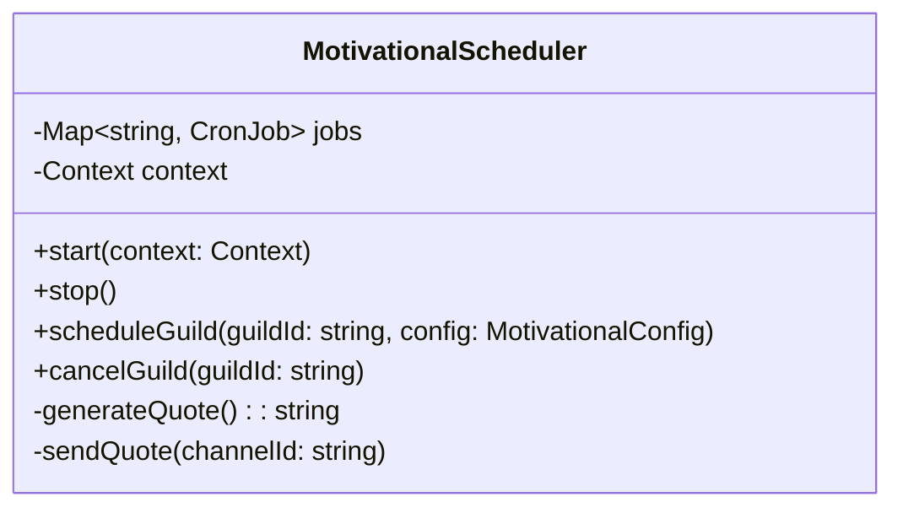
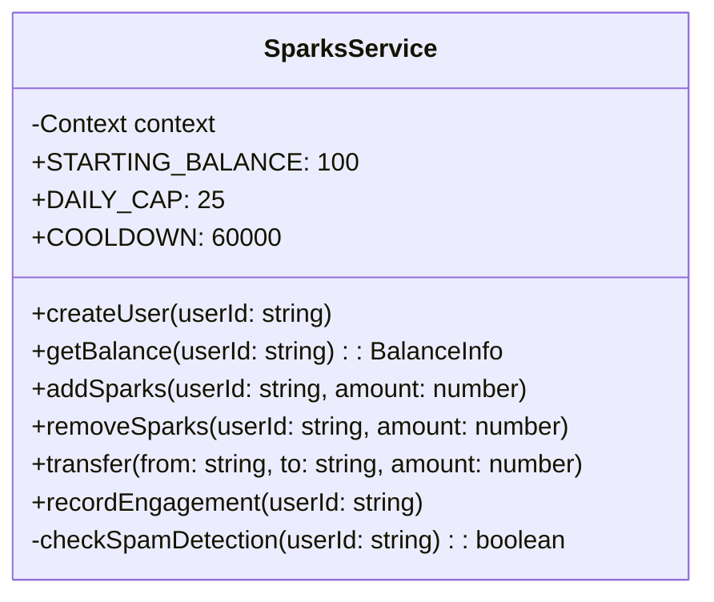
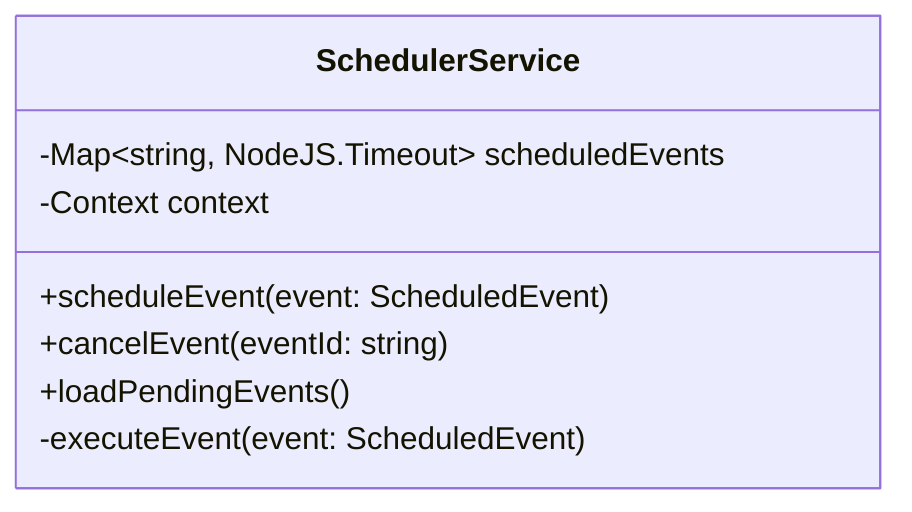

# Major Components

## Component Overview



## 1. Slash Commands (`src/commands/`)

51 slash commands organized by category:

### Entertainment Commands

| Command | File | Description |
|---------|------|-------------|
| `/8ball` | `8ball.ts` | Magic 8-ball fortune telling |
| `/dadjokes` | `dadjokes.ts` | Random dad jokes |
| `/fear` | `fear.ts` | Dune "litany against fear" |
| `/joke` | `joke.ts` | Random jokes from API |
| `/meme` | `meme.ts` | Generate memes with templates |
| `/quote` | `quote.ts` | Random inspirational quotes |
| `/roast` | `roast.ts` | Playful roast messages |
| `/ship` | `ship.ts` | Compatibility shipping |
| `/trivia` | `trivia.ts` | Trivia questions |
| `/affirmation` | `affirmation.ts` | Positive affirmations |
| `/drink` | `drink.ts` | Drink recipes |
| `/fortune` | `fortune.ts` | Fortune cookie messages |

### Gaming Commands

| Command | File | Description |
|---------|------|-------------|
| `/dnd` | `dnd.ts` | D&D game system |
| `/dice` | `dice.ts` | Dice rolling |
| `/guess` | `guess.ts` | Number guessing game |
| `/rps` | `rps.ts` | Rock-paper-scissors |
| `/poll` | `poll.ts` | Interactive polls with voting |
| `/rollcall` | `rollcall.ts` | Attendance tracking |
| `/dota` | `dota.ts` | Dota 2 hero/player lookup |
| `/arc` | `arc.ts` | Arc Raiders item database |
| `/riddle` | `riddle.ts` | Riddle game |
| `/police` | `police.ts` | Police quiz game |

### Voice Commands

| Command | File | Description |
|---------|------|-------------|
| `/join` | `join.ts` | Bot joins voice channel |
| `/leave` | `leave.ts` | Bot leaves voice channel |
| `/speak` | `speak.ts` | Text-to-speech |
| `/tts-config` | `tts-config.ts` | Configure TTS settings |

### Content Management Commands

| Command | File | Description |
|---------|------|-------------|
| `/adlibs` | `adlibs.ts` | Mad-libs templates |
| `/louds` | `louds.ts` | All-caps responses |
| `/memories` | `memories.ts` | Guild memories |
| `/meme-template` | `meme-template.ts` | Define meme templates |
| `/motivational-config` | `motivational-config.ts` | Scheduled quotes |
| `/remind` | `remind.ts` | Set reminders |

### Information Commands

| Command | File | Description |
|---------|------|-------------|
| `/weather` | `weather.ts` | Weather forecasts |
| `/horoscope` | `horoscope.ts` | Zodiac horoscopes |
| `/translate` | `translate.ts` | Language translation |
| `/is` | `is.ts` | Conceptual queries |
| `/fact` | `fact.ts` | Random facts |
| `/qrcode` | `qrcode.ts` | Generate QR codes |
| `/color` | `color.ts` | Color utilities |

### External Service Commands

| Command | File | Description |
|---------|------|-------------|
| `/twitch` | `twitch.ts` | Twitch notifications |
| `/coinbase` | `coinbase.ts` | Crypto prices |
| `/stock` | `stock.ts` | Stock market prices |
| `/balance` | `balance.ts` | Account balance |
| `/calc` | `calc.ts` | Calculator |

### Utility Commands

| Command | File | Description |
|---------|------|-------------|
| `/config` | `config.ts` | Bot configuration |
| `/reload` | `reload.ts` | Hot-reload commands |
| `/server` | `server.ts` | Server information |
| `/stats` | `stats.ts` | Bot statistics |
| `/avatar` | `avatar.ts` | User avatar |
| `/verify` | `verify.ts` | Server verification |
| `/sentry-test` | `sentry-test.ts` | Test error tracking |

### Command Structure Pattern

```typescript
// Standard command structure
export const data = new SlashCommandBuilder()
    .setName('command-name')
    .setDescription('Command description')
    .addStringOption(option =>
        option.setName('query')
            .setDescription('Search query')
            .setRequired(true)
            .setAutocomplete(true));

export async function execute(
    interaction: ChatInputCommandInteraction,
    context: Context
): Promise<void> {
    // Command implementation
    await interaction.reply({ embeds: [embed] });
}

export async function autocomplete(
    interaction: AutocompleteInteraction,
    context: Context
): Promise<void> {
    // Autocomplete implementation
    await interaction.respond(choices);
}
```

## 2. Message Response Handlers (`src/responses/`)

8 response handlers executed in priority order:



### Response Handler Details

| Priority | Handler | File | Description |
|----------|---------|------|-------------|
| 1 | Verification | `verification.ts` | Welcome channel code processing |
| 2 | D&D | `dnd.ts` | In-channel D&D game responses |
| 3 | Assistant | `assistant.ts` | OpenAI NLP responses (70% confidence threshold) |
| 4 | Triggers | `triggers.ts` | Custom keyword/phrase matching |
| 5 | Adlibs | `adlibs.ts` | Mad-libs template replacements |
| 6 | Louds | `louds.ts` | ALL-CAPS message responses |
| 7 | Tips | `tips.ts` | Random helpful tips |
| 8 | Greetings | `greetings.ts` | Greeting acknowledgements |

### Assistant Response Component



## 3. Event Handlers (`events/`)

10 Discord event handlers:

| Event | File | Description |
|-------|------|-------------|
| `ready` | `ready.ts` | Bot initialization, service startup |
| `messageCreate` | `messageCreate.ts` | Message response system |
| `interactionCreate` | `interactionCreate.ts` | Slash command routing |
| `guildMemberAdd` | `guildMemberAdd.ts` | New member events |
| `guildMemberRemove` | `guildMemberRemove.ts` | Member leave events |
| `guildMemberUpdate` | `guildMemberUpdate.ts` | Role/status updates |
| `guildBanAdd` | `guildBanAdd.ts` | Ban events |
| `guildBanRemove` | `guildBanRemove.ts` | Unban events |
| `messageDelete` | `messageDelete.ts` | Deleted message logging |
| `voiceStateUpdate` | `voiceStateUpdate.ts` | Voice channel changes |

### Event Handler Pattern

```typescript
const eventHandler: BotEvent = {
    name: Events.MessageCreate,
    once: false,  // Run on every event (vs once for ready)
    async execute(message: Message, context: Context) {
        // Event handling logic
    }
};

export default eventHandler;
```

## 4. Services (`src/services/`)

### VoiceService

Manages Discord voice channel connections with OpenAI TTS.



**Features:**
- Voice channel connection management
- OpenAI TTS integration (alloy, echo, fable, onyx, nova, shimmer voices)
- Automatic cleanup on disconnection
- Per-guild connection tracking
- Audio player management

### MotivationalScheduler

Background scheduling for motivational quotes.



**Features:**
- Guild-specific configuration
- Cron-based scheduling (node-cron)
- Database-driven settings
- Graceful shutdown

### SparksService

In-game economy system management.



**Features:**
- User account creation
- Balance management (current, escrow, lifetime)
- Transaction ledger
- Spam detection (6 messages in 10 minutes)
- Message cooldown (60 seconds)
- Daily earning cap (25 sparks)

### SchedulerService

Event scheduling and reminders.



## 5. Database Models (`src/models/`)

21 Sequelize models organized by feature:

### Content Storage Models

| Model | File | Description |
|-------|------|-------------|
| Adlibs | `adlibs.ts` | Mad-libs templates with placeholders |
| Louds | `louds.ts` | All-caps responses |
| Memories | `memories.ts` | Guild key-value storage |
| MemeTemplate | `memeTemplate.ts` | Meme template definitions |

### Configuration Models

| Model | File | Description |
|-------|------|-------------|
| Config | `config.ts` | Global bot settings |
| MotivationalConfig | `motivationalConfig.ts` | Per-guild quote settings |
| TwitchConfig | `twitchConfig.ts` | Twitch notifications |

### Interactive Feature Models

| Model | File | Description |
|-------|------|-------------|
| Poll | `Poll.ts` | Poll questions and options |
| PollVote | `PollVote.ts` | Individual vote records |
| RollCall | `RollCall.ts` | Attendance tracking |

### Gaming Feature Models

| Model | File | Description |
|-------|------|-------------|
| DndGame | `DndGame.ts` | D&D game state |
| CustomDice | `CustomDice.ts` | Custom dice configs |
| DotaHeroes | `DotaHeroes.ts` | Dota 2 hero data |
| DotaUsers | `DotaUsers.ts` | User Dota 2 profiles |
| ArcWishlist | `ArcWishlist.ts` | Arc Raiders wishlists |

### Economy Models (Sparks)

| Model | File | Description |
|-------|------|-------------|
| SparksUser | `SparksUser.ts` | User accounts |
| SparksBalance | `SparksBalance.ts` | Currency balances |
| SparksLedger | `SparksLedger.ts` | Transaction history |
| SparksEngagement | `SparksEngagement.ts` | Engagement tracking |

### Utility Models

| Model | File | Description |
|-------|------|-------------|
| VerificationCode | `VerificationCode.ts` | Verification codes |
| ScheduledEvent | `ScheduledEvent.ts` | Scheduled events |
| UserDescriptions | `UserDescriptions.ts` | User profiles |
| HoroscopeUser | `HoroscopeUser.ts` | Horoscope users |
| HoroscopeCache | `HoroscopeCache.ts` | Cached horoscopes |

## 6. Utility Modules (`src/utils/`)

14+ utility modules:

| Module | File | Description |
|--------|------|-------------|
| Types | `types.ts` | Core TypeScript interfaces |
| Logger | `logger.ts` | Bunyan structured logging |
| Permissions | `permissions.ts` | Owner permission validation |
| Discord Helpers | `discordHelpers.ts` | Safe Discord API wrappers |
| Assistant | `assistant.ts` | OpenAI conversation management |
| Hybrid Classifier | `hybrid-classifier.ts` | Bayesian + keyword classification |
| Trigger Cache | `triggerCache.ts` | LRU cache for triggers |
| Meme Generator | `memeGenerator.ts` | Canvas-based meme generation |
| Motivational Generator | `motivationalGenerator.ts` | Quote generation |
| Constants | `constants.ts` | Application constants |
| Color Utils | `colorUtils.ts` | Color manipulation |
| Time Parser | `timeParser.ts` | Natural language time parsing |
| Zodiac Util | `zodiacUtil.ts` | Zodiac calculations |
| Horoscope Generator | `horoscopeGenerator.ts` | Horoscope generation |
| Polygon Service | `polygon-service.ts` | Stock market API |
| Test Helpers | `testHelpers.ts` | Jest test utilities |

## 7. API Integrations (`src/lib/apis/`)

| API | File | Description |
|-----|------|-------------|
| Metaforge | `metaforge.ts` | Arc Raiders game data |
| OpenDota | `opendota.ts` | Dota 2 statistics |
| Twitch | `twitch.ts` | Stream notifications |

## 8. Core Libraries (`src/lib/`)

| Library | File | Description |
|---------|------|-------------|
| Sentry | `sentry.ts` | Error tracking and performance |
| Server | `server.ts` | HTTP webhook server |
