# Data Models

## Database Overview

Alia-bot uses MySQL 8.0 with Sequelize ORM. The database contains 21 tables organized by feature domain.

```mermaid
erDiagram
    %% Content Storage
    Adlibs {
        int id PK
        string guildId
        string template
        string placeholders
        datetime createdAt
        datetime updatedAt
    }

    Louds {
        int id PK
        string guildId
        string trigger
        string response
        datetime createdAt
        datetime updatedAt
    }

    Memories {
        int id PK
        string guildId
        string key
        string value
        string createdBy
        datetime createdAt
        datetime updatedAt
    }

    MemeTemplate {
        int id PK
        string name
        string topText
        string bottomText
        string imageUrl
        datetime createdAt
        datetime updatedAt
    }

    %% Configuration
    Config {
        int id PK
        string key UK
        string value
        datetime createdAt
        datetime updatedAt
    }

    MotivationalConfig {
        int id PK
        string guildId UK
        string channelId
        string schedule
        boolean enabled
        datetime createdAt
        datetime updatedAt
    }

    TwitchConfig {
        int id PK
        string guildId
        string twitchUsername
        string channelId
        boolean enabled
        datetime createdAt
        datetime updatedAt
    }

    %% Interactive Features
    Poll {
        int id PK
        string guildId
        string channelId
        string messageId
        string question
        json options
        string createdBy
        datetime expiresAt
        datetime createdAt
        datetime updatedAt
    }

    PollVote {
        int id PK
        int pollId FK
        string oderId
        int optionIndex
        datetime createdAt
    }

    Poll ||--o{ PollVote : "has"

    RollCall {
        int id PK
        string guildId
        string eventName
        json attendees
        string createdBy
        datetime eventDate
        datetime createdAt
        datetime updatedAt
    }

    %% Gaming Features
    DndGame {
        int id PK
        string guildId
        string channelId
        json gameState
        string dmUserId
        boolean active
        datetime createdAt
        datetime updatedAt
    }

    CustomDice {
        int id PK
        string guildId
        string name
        string formula
        string createdBy
        datetime createdAt
        datetime updatedAt
    }

    DotaHeroes {
        int id PK
        int heroId UK
        string localizedName
        string primaryAttr
        string attackType
        json roles
        json heroStats
        datetime createdAt
        datetime updatedAt
    }

    DotaUsers {
        int id PK
        string oderId UK
        int steamId
        string personaName
        datetime lastUpdated
        datetime createdAt
        datetime updatedAt
    }

    ArcWishlist {
        int id PK
        string oderId
        string guildId
        string itemId
        string itemName
        datetime createdAt
        datetime updatedAt
    }

    %% Economy System
    SparksUser {
        int id PK
        string oderId UK
        datetime createdAt
        datetime updatedAt
    }

    SparksBalance {
        int id PK
        int userId FK
        int current
        int escrow
        int lifetime
        datetime createdAt
        datetime updatedAt
    }

    SparksLedger {
        int id PK
        int userId FK
        int amount
        string type
        string description
        string referenceId
        datetime createdAt
    }

    SparksEngagement {
        int id PK
        int userId FK
        string guildId
        string channelId
        int messageCount
        datetime lastMessage
        datetime createdAt
        datetime updatedAt
    }

    SparksUser ||--|| SparksBalance : "has"
    SparksUser ||--o{ SparksLedger : "transactions"
    SparksUser ||--o{ SparksEngagement : "activity"

    %% Utility
    VerificationCode {
        int id PK
        string guildId
        string code
        string oderId
        boolean used
        datetime expiresAt
        datetime createdAt
        datetime updatedAt
    }

    ScheduledEvent {
        int id PK
        string guildId
        string channelId
        string eventType
        json eventData
        datetime scheduledFor
        boolean executed
        datetime createdAt
        datetime updatedAt
    }

    UserDescriptions {
        int id PK
        string oderId UK
        string description
        datetime createdAt
        datetime updatedAt
    }

    HoroscopeUser {
        int id PK
        string oderId UK
        string zodiacSign
        datetime createdAt
        datetime updatedAt
    }

    HoroscopeCache {
        int id PK
        string zodiacSign
        string horoscope
        date cacheDate
        datetime createdAt
        datetime updatedAt
    }

    HoroscopeUser ||--o{ HoroscopeCache : "caches"
```



## Model Details by Category

### Content Storage Models

#### Adlibs

Stores Mad-libs style templates for text replacement.

| Column | Type | Constraints | Description |
|--------|------|-------------|-------------|
| id | INTEGER | PK, AUTO_INCREMENT | Primary key |
| guildId | STRING | NOT NULL | Discord guild ID |
| template | TEXT | NOT NULL | Template with placeholders |
| placeholders | JSON | NOT NULL | Array of placeholder definitions |
| createdAt | DATETIME | AUTO | Creation timestamp |
| updatedAt | DATETIME | AUTO | Update timestamp |

**Example:**
```json
{
  "guildId": "123456789",
  "template": "The {adjective} {noun} {verb} over the {noun}.",
  "placeholders": ["adjective", "noun", "verb", "noun"]
}
```

#### Louds

Stores all-caps trigger/response pairs.

| Column | Type | Constraints | Description |
|--------|------|-------------|-------------|
| id | INTEGER | PK, AUTO_INCREMENT | Primary key |
| guildId | STRING | NOT NULL | Discord guild ID |
| trigger | STRING | NOT NULL | Trigger phrase |
| response | STRING | NOT NULL | Response text |
| createdAt | DATETIME | AUTO | Creation timestamp |
| updatedAt | DATETIME | AUTO | Update timestamp |

#### Memories

Key-value storage for guild-specific data.

| Column | Type | Constraints | Description |
|--------|------|-------------|-------------|
| id | INTEGER | PK, AUTO_INCREMENT | Primary key |
| guildId | STRING | NOT NULL | Discord guild ID |
| key | STRING | NOT NULL | Memory key |
| value | TEXT | NOT NULL | Memory value |
| createdBy | STRING | NOT NULL | Creator's user ID |
| createdAt | DATETIME | AUTO | Creation timestamp |
| updatedAt | DATETIME | AUTO | Update timestamp |

**Unique Constraint:** `(guildId, key)`

#### MemeTemplate

Meme template definitions for image generation.

| Column | Type | Constraints | Description |
|--------|------|-------------|-------------|
| id | INTEGER | PK, AUTO_INCREMENT | Primary key |
| name | STRING | NOT NULL, UNIQUE | Template name |
| topText | STRING | NULL | Default top text position |
| bottomText | STRING | NULL | Default bottom text position |
| imageUrl | STRING | NOT NULL | Template image URL |
| createdAt | DATETIME | AUTO | Creation timestamp |
| updatedAt | DATETIME | AUTO | Update timestamp |

### Configuration Models

#### Config

Global bot configuration key-value store.

| Column | Type | Constraints | Description |
|--------|------|-------------|-------------|
| id | INTEGER | PK, AUTO_INCREMENT | Primary key |
| key | STRING | NOT NULL, UNIQUE | Configuration key |
| value | TEXT | NOT NULL | Configuration value |
| createdAt | DATETIME | AUTO | Creation timestamp |
| updatedAt | DATETIME | AUTO | Update timestamp |

**Common Keys:**
- `assistant_thread_id` - OpenAI thread ID
- `owner_id` - Bot owner user ID
- `default_tts_voice` - Default TTS voice

#### MotivationalConfig

Per-guild motivational quote scheduling configuration.

| Column | Type | Constraints | Description |
|--------|------|-------------|-------------|
| id | INTEGER | PK, AUTO_INCREMENT | Primary key |
| guildId | STRING | NOT NULL, UNIQUE | Discord guild ID |
| channelId | STRING | NOT NULL | Target channel ID |
| schedule | STRING | NOT NULL | Cron schedule expression |
| enabled | BOOLEAN | DEFAULT: false | Active status |
| createdAt | DATETIME | AUTO | Creation timestamp |
| updatedAt | DATETIME | AUTO | Update timestamp |

#### TwitchConfig

Twitch stream notification configuration.

| Column | Type | Constraints | Description |
|--------|------|-------------|-------------|
| id | INTEGER | PK, AUTO_INCREMENT | Primary key |
| guildId | STRING | NOT NULL | Discord guild ID |
| twitchUsername | STRING | NOT NULL | Twitch username |
| channelId | STRING | NOT NULL | Discord channel ID |
| enabled | BOOLEAN | DEFAULT: true | Active status |
| createdAt | DATETIME | AUTO | Creation timestamp |
| updatedAt | DATETIME | AUTO | Update timestamp |

### Interactive Feature Models

#### Poll

Poll questions and metadata.

| Column | Type | Constraints | Description |
|--------|------|-------------|-------------|
| id | INTEGER | PK, AUTO_INCREMENT | Primary key |
| guildId | STRING | NOT NULL | Discord guild ID |
| channelId | STRING | NOT NULL | Channel containing poll |
| messageId | STRING | NOT NULL | Poll message ID |
| question | STRING | NOT NULL | Poll question |
| options | JSON | NOT NULL | Array of option strings |
| createdBy | STRING | NOT NULL | Creator's user ID |
| expiresAt | DATETIME | NULL | Poll expiration time |
| createdAt | DATETIME | AUTO | Creation timestamp |
| updatedAt | DATETIME | AUTO | Update timestamp |

#### PollVote

Individual poll votes.

| Column | Type | Constraints | Description |
|--------|------|-------------|-------------|
| id | INTEGER | PK, AUTO_INCREMENT | Primary key |
| pollId | INTEGER | FK → Poll.id | Associated poll |
| oderId | STRING | NOT NULL | Voter's user ID |
| optionIndex | INTEGER | NOT NULL | Selected option index |
| createdAt | DATETIME | AUTO | Vote timestamp |

**Unique Constraint:** `(pollId, oderId)` - one vote per user per poll

#### RollCall

Event attendance tracking.

| Column | Type | Constraints | Description |
|--------|------|-------------|-------------|
| id | INTEGER | PK, AUTO_INCREMENT | Primary key |
| guildId | STRING | NOT NULL | Discord guild ID |
| eventName | STRING | NOT NULL | Event name |
| attendees | JSON | NOT NULL | Array of user IDs |
| createdBy | STRING | NOT NULL | Creator's user ID |
| eventDate | DATETIME | NOT NULL | Event date/time |
| createdAt | DATETIME | AUTO | Creation timestamp |
| updatedAt | DATETIME | AUTO | Update timestamp |

### Gaming Feature Models

#### DndGame

D&D game state storage.

| Column | Type | Constraints | Description |
|--------|------|-------------|-------------|
| id | INTEGER | PK, AUTO_INCREMENT | Primary key |
| guildId | STRING | NOT NULL | Discord guild ID |
| channelId | STRING | NOT NULL | Game channel ID |
| gameState | JSON | NOT NULL | Full game state object |
| dmUserId | STRING | NOT NULL | Dungeon Master user ID |
| active | BOOLEAN | DEFAULT: true | Game active status |
| createdAt | DATETIME | AUTO | Creation timestamp |
| updatedAt | DATETIME | AUTO | Update timestamp |

**Unique Constraint:** `(guildId, channelId)`

#### CustomDice

Custom dice roll configurations.

| Column | Type | Constraints | Description |
|--------|------|-------------|-------------|
| id | INTEGER | PK, AUTO_INCREMENT | Primary key |
| guildId | STRING | NOT NULL | Discord guild ID |
| name | STRING | NOT NULL | Dice name |
| formula | STRING | NOT NULL | Dice formula (e.g., "2d6+5") |
| createdBy | STRING | NOT NULL | Creator's user ID |
| createdAt | DATETIME | AUTO | Creation timestamp |
| updatedAt | DATETIME | AUTO | Update timestamp |

**Unique Constraint:** `(guildId, name)`

#### DotaHeroes

Cached Dota 2 hero data.

| Column | Type | Constraints | Description |
|--------|------|-------------|-------------|
| id | INTEGER | PK, AUTO_INCREMENT | Primary key |
| heroId | INTEGER | NOT NULL, UNIQUE | Dota 2 hero ID |
| localizedName | STRING | NOT NULL | Hero display name |
| primaryAttr | STRING | NOT NULL | str/agi/int |
| attackType | STRING | NOT NULL | Melee/Ranged |
| roles | JSON | NOT NULL | Array of role strings |
| heroStats | JSON | NULL | Detailed statistics |
| createdAt | DATETIME | AUTO | Creation timestamp |
| updatedAt | DATETIME | AUTO | Update timestamp |

#### DotaUsers

User Dota 2 profile links.

| Column | Type | Constraints | Description |
|--------|------|-------------|-------------|
| id | INTEGER | PK, AUTO_INCREMENT | Primary key |
| oderId | STRING | NOT NULL, UNIQUE | Discord user ID |
| steamId | INTEGER | NOT NULL | Steam account ID |
| personaName | STRING | NULL | Steam display name |
| lastUpdated | DATETIME | NULL | Last profile sync |
| createdAt | DATETIME | AUTO | Creation timestamp |
| updatedAt | DATETIME | AUTO | Update timestamp |

#### ArcWishlist

Arc Raiders item wishlists.

| Column | Type | Constraints | Description |
|--------|------|-------------|-------------|
| id | INTEGER | PK, AUTO_INCREMENT | Primary key |
| oderId | STRING | NOT NULL | Discord user ID |
| guildId | STRING | NOT NULL | Discord guild ID |
| itemId | STRING | NOT NULL | Arc item ID |
| itemName | STRING | NOT NULL | Item display name |
| createdAt | DATETIME | AUTO | Creation timestamp |
| updatedAt | DATETIME | AUTO | Update timestamp |

**Unique Constraint:** `(oderId, guildId, itemId)`

### Economy System Models (Sparks)

#### SparksUser

User accounts in the economy system.

| Column | Type | Constraints | Description |
|--------|------|-------------|-------------|
| id | INTEGER | PK, AUTO_INCREMENT | Primary key |
| oderId | STRING | NOT NULL, UNIQUE | Discord user ID |
| createdAt | DATETIME | AUTO | Account creation |
| updatedAt | DATETIME | AUTO | Last update |

#### SparksBalance

User currency balances.

| Column | Type | Constraints | Description |
|--------|------|-------------|-------------|
| id | INTEGER | PK, AUTO_INCREMENT | Primary key |
| userId | INTEGER | FK → SparksUser.id | User reference |
| current | INTEGER | DEFAULT: 100 | Available balance |
| escrow | INTEGER | DEFAULT: 0 | Held funds |
| lifetime | INTEGER | DEFAULT: 100 | Total ever earned |
| createdAt | DATETIME | AUTO | Creation timestamp |
| updatedAt | DATETIME | AUTO | Update timestamp |

**One-to-One:** Each SparksUser has exactly one SparksBalance

#### SparksLedger

Transaction history.

| Column | Type | Constraints | Description |
|--------|------|-------------|-------------|
| id | INTEGER | PK, AUTO_INCREMENT | Primary key |
| userId | INTEGER | FK → SparksUser.id | User reference |
| amount | INTEGER | NOT NULL | Transaction amount (+/-) |
| type | STRING | NOT NULL | Transaction type |
| description | STRING | NULL | Transaction description |
| referenceId | STRING | NULL | External reference |
| createdAt | DATETIME | AUTO | Transaction timestamp |

**Transaction Types:** `earn`, `spend`, `transfer_in`, `transfer_out`, `escrow_in`, `escrow_out`

#### SparksEngagement

Activity tracking for earning rewards.

| Column | Type | Constraints | Description |
|--------|------|-------------|-------------|
| id | INTEGER | PK, AUTO_INCREMENT | Primary key |
| userId | INTEGER | FK → SparksUser.id | User reference |
| guildId | STRING | NOT NULL | Discord guild ID |
| channelId | STRING | NOT NULL | Discord channel ID |
| messageCount | INTEGER | DEFAULT: 0 | Messages today |
| lastMessage | DATETIME | NULL | Last message time |
| createdAt | DATETIME | AUTO | Creation timestamp |
| updatedAt | DATETIME | AUTO | Update timestamp |

**Unique Constraint:** `(userId, guildId, date(createdAt))`

### Utility Models

#### VerificationCode

Server verification codes.

| Column | Type | Constraints | Description |
|--------|------|-------------|-------------|
| id | INTEGER | PK, AUTO_INCREMENT | Primary key |
| guildId | STRING | NOT NULL | Discord guild ID |
| code | STRING | NOT NULL | Verification code |
| oderId | STRING | NULL | User who used code |
| used | BOOLEAN | DEFAULT: false | Usage status |
| expiresAt | DATETIME | NOT NULL | Expiration time |
| createdAt | DATETIME | AUTO | Creation timestamp |
| updatedAt | DATETIME | AUTO | Update timestamp |

#### ScheduledEvent

Scheduled events and reminders.

| Column | Type | Constraints | Description |
|--------|------|-------------|-------------|
| id | INTEGER | PK, AUTO_INCREMENT | Primary key |
| guildId | STRING | NOT NULL | Discord guild ID |
| channelId | STRING | NOT NULL | Target channel ID |
| eventType | STRING | NOT NULL | Event type |
| eventData | JSON | NOT NULL | Event payload |
| scheduledFor | DATETIME | NOT NULL | Execution time |
| executed | BOOLEAN | DEFAULT: false | Execution status |
| createdAt | DATETIME | AUTO | Creation timestamp |
| updatedAt | DATETIME | AUTO | Update timestamp |

**Event Types:** `reminder`, `announcement`, `poll_close`

#### UserDescriptions

User profile descriptions.

| Column | Type | Constraints | Description |
|--------|------|-------------|-------------|
| id | INTEGER | PK, AUTO_INCREMENT | Primary key |
| oderId | STRING | NOT NULL, UNIQUE | Discord user ID |
| description | TEXT | NOT NULL | User description |
| createdAt | DATETIME | AUTO | Creation timestamp |
| updatedAt | DATETIME | AUTO | Update timestamp |

#### HoroscopeUser

User zodiac sign preferences.

| Column | Type | Constraints | Description |
|--------|------|-------------|-------------|
| id | INTEGER | PK, AUTO_INCREMENT | Primary key |
| oderId | STRING | NOT NULL, UNIQUE | Discord user ID |
| zodiacSign | STRING | NOT NULL | Zodiac sign |
| createdAt | DATETIME | AUTO | Creation timestamp |
| updatedAt | DATETIME | AUTO | Update timestamp |

**Valid Signs:** `aries`, `taurus`, `gemini`, `cancer`, `leo`, `virgo`, `libra`, `scorpio`, `sagittarius`, `capricorn`, `aquarius`, `pisces`

#### HoroscopeCache

Cached horoscope readings by date.

| Column | Type | Constraints | Description |
|--------|------|-------------|-------------|
| id | INTEGER | PK, AUTO_INCREMENT | Primary key |
| zodiacSign | STRING | NOT NULL | Zodiac sign |
| horoscope | TEXT | NOT NULL | Horoscope text |
| cacheDate | DATE | NOT NULL | Cache validity date |
| createdAt | DATETIME | AUTO | Creation timestamp |
| updatedAt | DATETIME | AUTO | Update timestamp |

**Unique Constraint:** `(zodiacSign, cacheDate)`

## Migration History

| Migration | Date | Description |
|-----------|------|-------------|
| 20250103000000 | 2025-01-03 | Horoscope tables |
| 20250115000000 | 2025-01-15 | D&D game table |
| 20250125000000 | 2025-01-25 | Custom dice |
| 20250604000000 | 2025-06-04 | User descriptions |
| 20250604100000 | 2025-06-04 | Scheduled events |
| 20260106000000 | 2026-01-06 | Sparks economy system |
| 20260107000000 | 2026-01-07 | Dota user profiles |
| 20260108000000 | 2026-01-08 | Dota heroes data |
| 20260108200000 | 2026-01-08 | Dota hero stats |
| 20260113000000 | 2026-01-13 | Arc Raiders wishlist |

## Database Connection Pool

```typescript
{
    max: 5,      // Maximum connections
    min: 0,      // Minimum connections
    acquire: 30000,  // Max time to acquire (ms)
    idle: 10000      // Max idle time (ms)
}
```
