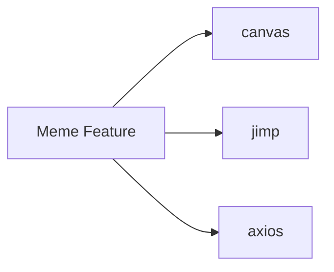
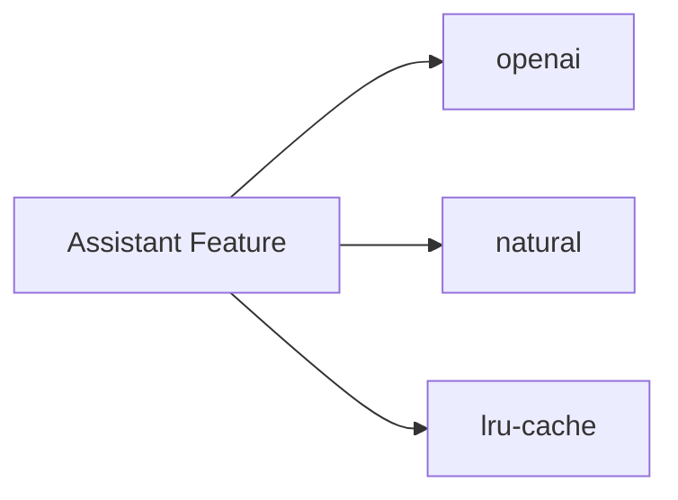
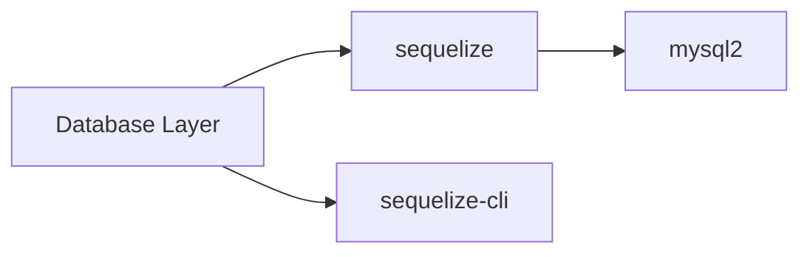

# External Dependencies

## Dependency Overview

Alia-bot has 62 production dependencies and 19 development dependencies.

```mermaid
graph TB
    subgraph "Core Framework"
        DJ[discord.js]
        DJV[discord.js/voice]
    end

    subgraph "AI & NLP"
        OAI[openai]
        NAT[natural]
    end

    subgraph "Database"
        SEQ[sequelize]
        MYSQL[mysql2]
    end

    subgraph "HTTP & APIs"
        AX[axios]
        POLY[polygon.io]
    end

    subgraph "Monitoring"
        SEN[@sentry/node]
        BUN[bunyan]
    end

    subgraph "Media"
        CVS[canvas]
        JIMP[jimp]
        FFMPEG[ffmpeg-static]
        DVY[@snazzah/davey]
    end

    subgraph "Utilities"
        CFG[config]
        CRON[node-cron]
        LDH[lodash]
    end

    DJ --> BOT[Alia-Bot]
    DJV --> BOT
    OAI --> BOT
    NAT --> BOT
    SEQ --> BOT
    MYSQL --> BOT
    AX --> BOT
    POLY --> BOT
    SEN --> BOT
    BUN --> BOT
    CVS --> BOT
    JIMP --> BOT
    FFMPEG --> BOT
    DVY --> BOT
    CFG --> BOT
    CRON --> BOT
    LDH --> BOT
```

## Production Dependencies (62)

### Discord Integration

| Package | Version | Purpose |
|---------|---------|---------|
| `discord.js` | ^14.13.0 | Discord API client |
| `@discordjs/voice` | ^0.19.0 | Voice channel support |
| `@discordjs/opus` | ^0.10.0 | Opus audio encoding |
| `@discordjs/rest` | ^2.0.0 | REST API client |
| `discord-api-types` | ^0.37.0 | TypeScript types |

**Usage:**
- Core bot functionality
- Slash command handling
- Message events
- Voice channel connections
- Audio playback

### AI & Natural Language Processing

| Package | Version | Purpose |
|---------|---------|---------|
| `openai` | ^4.20.1 | OpenAI API client |
| `natural` | ^6.10.4 | NLP toolkit (Bayesian classifier) |

**Usage:**
- GPT responses for assistant
- Text-to-speech generation
- Intent classification
- Message categorization

### Database

| Package | Version | Purpose |
|---------|---------|---------|
| `sequelize` | ^6.29.0 | ORM for MySQL |
| `mysql2` | ^3.14.3 | MySQL driver |

**Usage:**
- All database operations
- Model definitions
- Migrations
- Query building

### HTTP & External APIs

| Package | Version | Purpose |
|---------|---------|---------|
| `axios` | ^1.12.0 | HTTP client |
| `polygon.io` | ^2.1.2 | Stock market data |

**Usage:**
- External API calls
- Stock/crypto prices
- Third-party integrations

### Error Tracking & Logging

| Package | Version | Purpose |
|---------|---------|---------|
| `@sentry/node` | ^10.8.0 | Error tracking |
| `@sentry/profiling-node` | ^10.8.0 | Performance profiling |
| `bunyan` | ^1.8.15 | Structured logging |

**Usage:**
- Exception capture
- Performance monitoring
- Structured log output
- Error context

### Image & Media Processing

| Package | Version | Purpose |
|---------|---------|---------|
| `canvas` | ^3.2.0 | Image manipulation |
| `jimp` | ^1.6.0 | Image processing |
| `qrcode` | ^1.5.4 | QR code generation |
| `ffmpeg-static` | ^5.2.0 | FFmpeg binary |
| `@snazzah/davey` | ^0.1.6 | Audio processing |
| `sodium-native` | ^4.0.0 | Encryption for voice |
| `libsodium-wrappers` | ^0.7.15 | Sodium bindings |

**Usage:**
- Meme generation
- QR code creation
- Avatar manipulation
- Voice audio encoding
- Stream processing

### Configuration & Utilities

| Package | Version | Purpose |
|---------|---------|---------|
| `config` | ^4.1.1 | Configuration management |
| `dotenv` | ^16.0.0 | Environment variables |
| `lodash` | ^4.17.21 | Utility functions |
| `node-cron` | ^4.2.1 | Task scheduling |
| `uuid` | ^9.0.0 | UUID generation |
| `js-yaml` | ^4.1.0 | YAML parsing |

**Usage:**
- Environment configuration
- Scheduled tasks
- Data manipulation
- Unique identifiers

### Date & Time

| Package | Version | Purpose |
|---------|---------|---------|
| `chrono-node` | ^2.7.0 | Natural language date parsing |
| `dayjs` | ^1.11.0 | Date manipulation |

**Usage:**
- Reminder scheduling
- Time parsing
- Date formatting

### Data & Parsing

| Package | Version | Purpose |
|---------|---------|---------|
| `cheerio` | ^1.0.0 | HTML parsing |
| `zod` | ^3.22.0 | Schema validation |

**Usage:**
- Web scraping
- Data validation
- API response parsing

### Math & Calculations

| Package | Version | Purpose |
|---------|---------|---------|
| `mathjs` | ^12.0.0 | Math expressions |
| `dice-expression-evaluator` | ^3.0.0 | Dice roll parsing |

**Usage:**
- Calculator command
- Dice rolling
- Math operations

### Miscellaneous

| Package | Version | Purpose |
|---------|---------|---------|
| `lru-cache` | ^10.0.0 | In-memory caching |
| `node-fetch` | ^3.3.0 | Fetch API |
| `form-data` | ^4.0.0 | Multipart forms |
| `prism-media` | ^1.3.5 | Media streaming |
| `ws` | ^8.14.0 | WebSocket client |

## Development Dependencies (19)

### TypeScript

| Package | Version | Purpose |
|---------|---------|---------|
| `typescript` | ^5.2.0 | TypeScript compiler |
| `ts-node` | ^10.9.0 | TypeScript execution |
| `ts-jest` | ^29.1.0 | Jest TypeScript support |
| `@types/node` | ^20.0.0 | Node.js types |

### Testing

| Package | Version | Purpose |
|---------|---------|---------|
| `jest` | ^29.7.0 | Testing framework |
| `@types/jest` | ^29.5.0 | Jest types |
| `cross-env` | ^7.0.0 | Cross-platform env |

### Linting & Formatting

| Package | Version | Purpose |
|---------|---------|---------|
| `eslint` | ^8.51.0 | Code linting |
| `@typescript-eslint/parser` | ^6.7.0 | TypeScript parsing |
| `@typescript-eslint/eslint-plugin` | ^6.7.0 | TypeScript rules |
| `prettier` | ^3.0.0 | Code formatting |
| `eslint-config-prettier` | ^9.0.0 | Prettier integration |

### Database Tools

| Package | Version | Purpose |
|---------|---------|---------|
| `sequelize-cli` | ^6.6.0 | Migration CLI |

### Type Definitions

| Package | Version | Purpose |
|---------|---------|---------|
| `@types/lodash` | ^4.14.0 | Lodash types |
| `@types/bunyan` | ^1.8.0 | Bunyan types |
| `@types/config` | ^3.3.0 | Config types |
| `@types/uuid` | ^9.0.0 | UUID types |

## Dependency Graph by Feature

### Voice Feature Dependencies

```mermaid
graph LR
    VOICE[Voice Feature] --> DJV[@discordjs/voice]
    DJV --> OPUS[@discordjs/opus]
    DJV --> SODIUM[sodium-native]
    VOICE --> OAI[openai]
    VOICE --> FFMPEG[ffmpeg-static]
    VOICE --> PRISM[prism-media]
```

### Meme Generation Dependencies



### NLP Assistant Dependencies



### Database Dependencies



## Version Compatibility

### Node.js Requirements

- **Minimum:** Node.js 18.x
- **Recommended:** Node.js 24.x (current)
- **Engine:** Specified in package.json

### Database Compatibility

- **MySQL:** 8.0+
- **Sequelize:** Supports MySQL 5.7+ but 8.0 recommended

### Discord.js Requirements

- **discord.js 14.x** requires:
  - Node.js 18.x or higher
  - `@discordjs/voice` for voice support
  - Proper gateway intents

## Security Considerations

### Dependencies with Native Code

These packages require compilation and may need additional build tools:

| Package | Native Code | Platform Notes |
|---------|-------------|----------------|
| `canvas` | Yes | Requires Cairo |
| `sodium-native` | Yes | Encryption |
| `@discordjs/opus` | Yes | Audio codec |
| `ffmpeg-static` | Binary | Platform-specific |

### Packages with Network Access

| Package | Network Activity |
|---------|-----------------|
| `discord.js` | Discord API |
| `openai` | OpenAI API |
| `axios` | HTTP requests |
| `polygon.io` | Financial data |
| `@sentry/node` | Error reporting |

## Update Recommendations

### Critical Updates

Always keep these updated for security:
- `discord.js` - API changes and security fixes
- `openai` - API compatibility
- `@sentry/node` - Error tracking reliability
- `sequelize` - Database security

### Stable Packages

These can be updated less frequently:
- `lodash` - Utility functions (stable API)
- `bunyan` - Logging (mature package)
- `config` - Configuration (stable API)

### Breaking Change Watch

Monitor these for breaking changes:
- `discord.js` - Major API changes between versions
- `openai` - API version changes
- `sequelize` - Query behavior changes

## Dependency Audit

Run regularly:
```bash
npm audit              # Check vulnerabilities
npm outdated           # Check for updates
npm update             # Update within semver
```

## License Overview

| License | Count | Examples |
|---------|-------|----------|
| MIT | 45+ | discord.js, lodash, axios |
| Apache-2.0 | 5+ | openai |
| ISC | 3+ | Various utilities |
| BSD-3 | 2+ | canvas |
