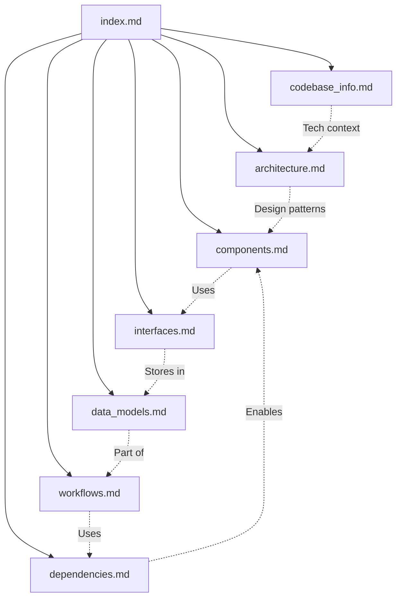

# Alia-Bot Documentation Index

> **AI Assistant Instructions**: This index serves as your primary reference for understanding the alia-bot codebase. Use the metadata and summaries below to identify which documentation files to consult for specific questions. Each file contains detailed information about its domain - refer to the relevant file for in-depth answers.

## Quick Reference

| Question Type | Consult |
|---------------|---------|
| "What technologies does this use?" | [codebase_info.md](#codebase-information) |
| "How is the code organized?" | [architecture.md](#system-architecture) |
| "What commands exist?" | [components.md](#major-components) |
| "How do I add a new API?" | [interfaces.md](#apis-and-integrations) |
| "What database tables exist?" | [data_models.md](#data-models) |
| "How does X workflow work?" | [workflows.md](#key-workflows) |
| "What packages are used?" | [dependencies.md](#dependencies) |

---

## Documentation Files

### Codebase Information
**File:** `codebase_info.md`

**Contains:**
- Project metadata (name, version, repository)
- Technology stack summary
- Project statistics (files, lines, coverage)
- Directory structure overview
- Build commands
- Environment variables

**Use when:** You need basic project facts, want to understand the tech stack, or need environment setup information.

**Key Facts:**
- Discord.js v14 bot with TypeScript
- MySQL 8.0 with Sequelize ORM
- 51 slash commands, 21 database models
- 88% test coverage threshold
- Node.js 24 runtime

---

### System Architecture
**File:** `architecture.md`

**Contains:**
- High-level architecture diagrams (Mermaid)
- Application layer descriptions
- Design patterns used (Context, Event-Driven, Factory, Singleton, Priority Chain)
- Module architecture details
- Data flow diagrams
- Error handling architecture
- Deployment architecture
- Security architecture

**Use when:** You need to understand how components connect, the overall system design, or how data flows through the application.

**Key Patterns:**
- **Context Pattern**: Shared object with tables, logger, services
- **Event-Driven**: Discord events trigger file-based handlers
- **Priority Chain**: Message responses processed in order
- **Factory**: Models initialized via factory functions
- **Singleton**: Services instantiated once at startup

---

### Major Components
**File:** `components.md`

**Contains:**
- All 51 slash commands (categorized)
- 8 message response handlers (with priority order)
- 10 event handlers
- 4 services (Voice, Motivational, Sparks, Scheduler)
- 21 database models (categorized)
- 14+ utility modules
- API integrations
- Core libraries

**Use when:** You need to find a specific command, understand what handlers exist, or locate a particular service or utility.

**Command Categories:**
- Entertainment (12): 8ball, dadjokes, meme, quote, etc.
- Gaming (10): dnd, dice, poll, dota, arc, etc.
- Voice (4): join, leave, speak, tts-config
- Content (8): adlibs, louds, memories, etc.
- Information (7): weather, horoscope, translate, etc.
- External (6): twitch, coinbase, stock, etc.
- Utility (6): config, reload, server, stats, etc.

**Response Priority:**
1. Verification → 2. D&D → 3. Assistant → 4. Triggers → 5. Adlibs → 6. Louds → 7. Tips → 8. Greetings

---

### APIs and Integrations
**File:** `interfaces.md`

**Contains:**
- Discord API integration details
- OpenAI API usage (chat, TTS)
- Metaforge API (Arc Raiders)
- OpenDota API
- Twitch API
- Polygon.io API
- Sentry.io integration
- Database interface patterns
- Internal API interfaces (Context, Command, Event, Response)
- Webhook endpoints

**Use when:** You need to understand how external APIs are used, want to add a new integration, or need to understand internal interfaces.

**Key Interfaces:**
- `Context`: Shared object with tables, log, sequelize, services
- `BotCommand`: data, execute, autocomplete
- `BotEvent`: name, once, execute
- `ResponseHandler`: name, priority, canHandle, execute

---

### Data Models
**File:** `data_models.md`

**Contains:**
- Complete ER diagram (Mermaid)
- All 21 table definitions with columns
- Relationships between tables
- Constraints and indexes
- Migration history
- Connection pool configuration

**Use when:** You need to understand the database schema, add a new model, or query existing data.

**Model Categories:**
- **Content Storage**: Adlibs, Louds, Memories, MemeTemplate
- **Configuration**: Config, MotivationalConfig, TwitchConfig
- **Interactive**: Poll, PollVote, RollCall
- **Gaming**: DndGame, CustomDice, DotaHeroes, DotaUsers, ArcWishlist
- **Economy**: SparksUser, SparksBalance, SparksLedger, SparksEngagement
- **Utility**: VerificationCode, ScheduledEvent, UserDescriptions, HoroscopeUser, HoroscopeCache

---

### Key Workflows
**File:** `workflows.md`

**Contains:**
- Application lifecycle (startup, shutdown)
- Command execution flow
- Autocomplete flow
- Message response priority processing
- NLP assistant classification
- Voice TTS workflow
- Database transaction patterns
- Poll creation and voting
- Scheduled event handling
- CI/CD pipeline
- Error handling flow
- Gaming workflows (D&D, Arc Raiders)

**Use when:** You need to understand how a specific feature works end-to-end, or want to trace the flow of a particular operation.

**Key Workflows:**
- Startup: ENV → Sentry → Client → DB → Models → Commands → Events → Services → Login
- Command: User → Discord → interactionCreate → Handler → Service → DB → Reply
- Response: Message → Priority Chain → First Match → Reply
- Voice: /speak → OpenAI TTS → Audio Buffer → Join Channel → Play → Cleanup

---

### Dependencies
**File:** `dependencies.md`

**Contains:**
- All 62 production dependencies with versions
- All 19 development dependencies
- Dependency categorization
- Feature-specific dependency graphs
- Version compatibility requirements
- Security considerations
- Update recommendations
- License overview

**Use when:** You need to understand what packages are used, want to add a new dependency, or need to audit/update dependencies.

**Key Dependencies:**
- **Discord**: discord.js, @discordjs/voice, @discordjs/opus
- **AI**: openai, natural
- **Database**: sequelize, mysql2
- **Media**: canvas, jimp, ffmpeg-static
- **Monitoring**: @sentry/node, bunyan
- **Testing**: jest, ts-jest

---

## Common Tasks Quick Reference

### Adding a New Slash Command

1. Read `components.md` for command structure pattern
2. Check `architecture.md` for Context interface
3. Create file in `src/commands/`
4. Export `data` (SlashCommandBuilder) and `execute` function
5. Optionally add `autocomplete` function

### Adding a New Database Model

1. Read `data_models.md` for schema patterns
2. Check existing models in `src/models/`
3. Create migration in `migrations/`
4. Create model file with factory function
5. Model auto-loads via dynamic import

### Adding External API Integration

1. Read `interfaces.md` for integration patterns
2. Check `dependencies.md` for HTTP client options
3. Create client in `src/lib/apis/`
4. Add caching if appropriate (see LRU cache usage)
5. Handle errors with Sentry context

### Adding a Message Response Handler

1. Read `components.md` for handler list and priorities
2. Check `workflows.md` for response flow
3. Create handler in `src/responses/`
4. Add to priority chain in `events/messageCreate.ts`

### Debugging Issues

1. Check `workflows.md` for relevant flow diagrams
2. Review Sentry for errors
3. Check Bunyan logs for structured output
4. Use `interfaces.md` for API debugging

---

## File Relationships

---

## Metadata Tags

Use these tags to quickly identify relevant content:

| Tag | Files |
|-----|-------|
| `#commands` | components.md |
| `#responses` | components.md, workflows.md |
| `#database` | data_models.md, interfaces.md |
| `#voice` | components.md, workflows.md, interfaces.md |
| `#ai` | interfaces.md, workflows.md |
| `#testing` | codebase_info.md, dependencies.md |
| `#deployment` | architecture.md, workflows.md |
| `#security` | architecture.md, dependencies.md |
| `#api` | interfaces.md |
| `#services` | components.md, workflows.md |

---

## Document Update History

| File | Last Updated | Version |
|------|--------------|---------|
| codebase_info.md | 2026-01-18 | 1.0.0 |
| architecture.md | 2026-01-18 | 1.0.0 |
| components.md | 2026-01-18 | 1.0.0 |
| interfaces.md | 2026-01-18 | 1.0.0 |
| data_models.md | 2026-01-18 | 1.0.0 |
| workflows.md | 2026-01-18 | 1.0.0 |
| dependencies.md | 2026-01-18 | 1.0.0 |
| index.md | 2026-01-18 | 1.0.0 |
