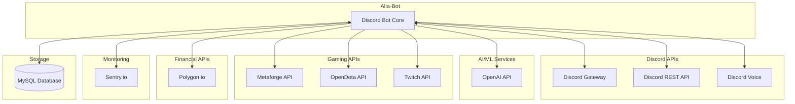
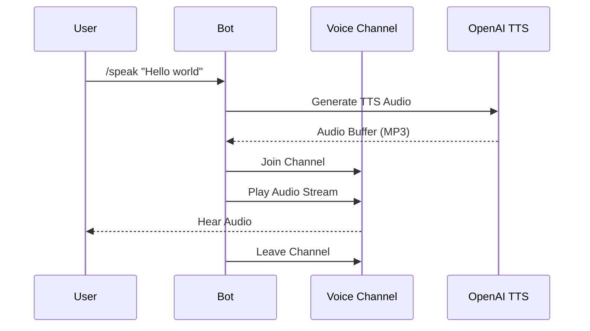
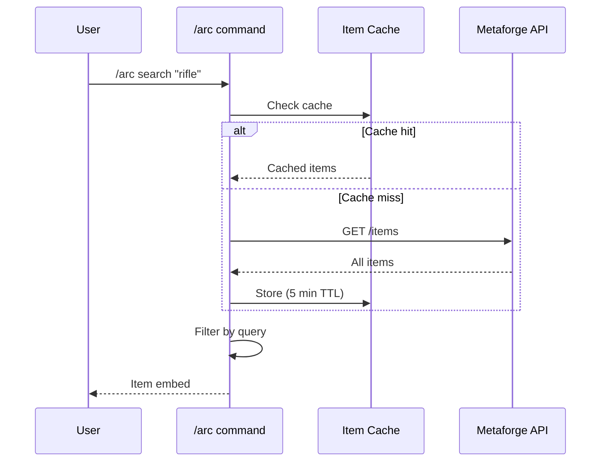
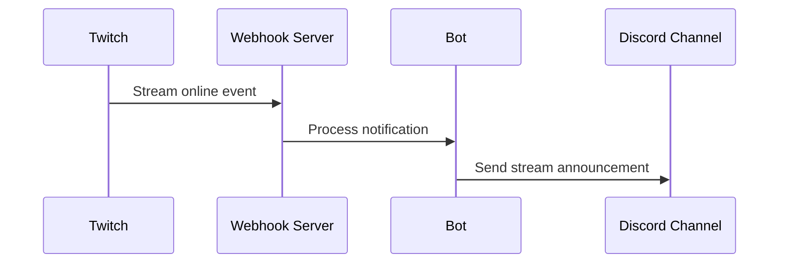
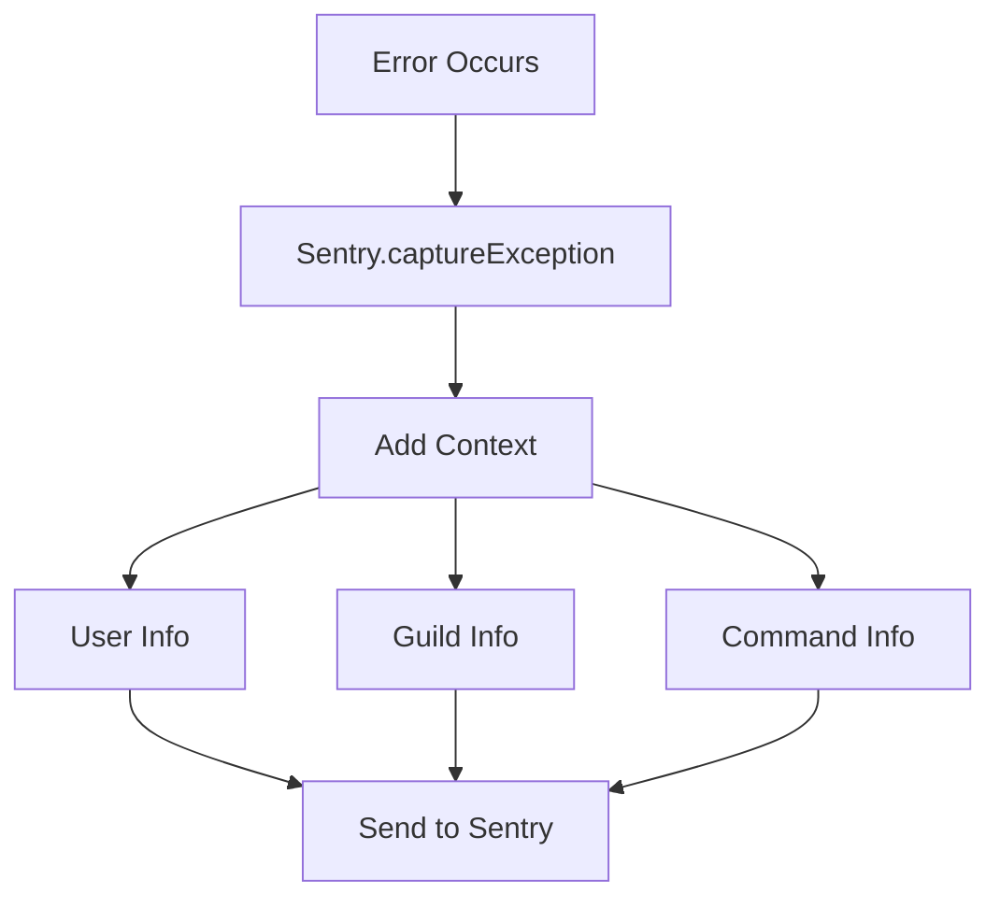
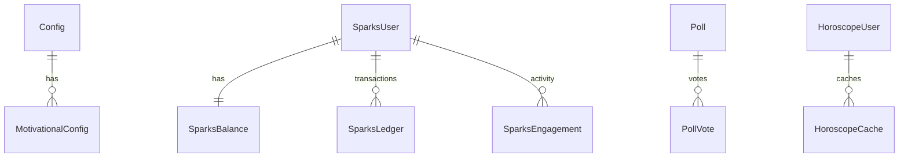
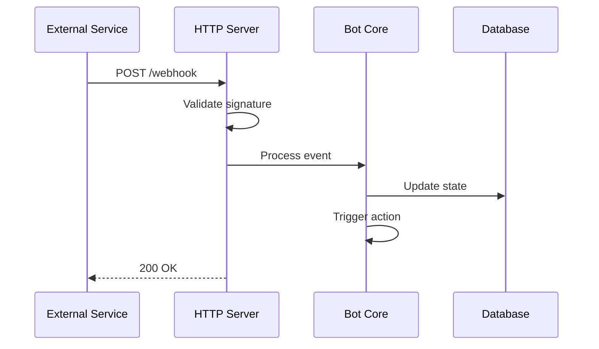

# APIs and Integration Points

## Interface Overview



## Discord API Integration

### Gateway Events (discord.js v14)

The bot connects to Discord's WebSocket gateway and listens for events:

```typescript
// Client intents configuration
const client = new Client({
    intents: [
        GatewayIntentBits.Guilds,
        GatewayIntentBits.GuildMessages,
        GatewayIntentBits.MessageContent,
        GatewayIntentBits.GuildMembers,
        GatewayIntentBits.GuildVoiceStates,
    ]
});
```

| Event | Handler | Purpose |
|-------|---------|---------|
| `ready` | `events/ready.ts` | Bot initialization |
| `messageCreate` | `events/messageCreate.ts` | Message processing |
| `interactionCreate` | `events/interactionCreate.ts` | Slash commands |
| `guildMemberAdd` | `events/guildMemberAdd.ts` | New members |
| `guildMemberRemove` | `events/guildMemberRemove.ts` | Leaving members |
| `guildMemberUpdate` | `events/guildMemberUpdate.ts` | Member updates |
| `guildBanAdd` | `events/guildBanAdd.ts` | Ban events |
| `guildBanRemove` | `events/guildBanRemove.ts` | Unban events |
| `messageDelete` | `events/messageDelete.ts` | Deleted messages |
| `voiceStateUpdate` | `events/voiceStateUpdate.ts` | Voice changes |

### Slash Command Registration

Commands are registered globally via Discord REST API:

```typescript
// Command registration (deploy-commands.ts)
const rest = new REST().setToken(process.env.BOT_TOKEN);
await rest.put(
    Routes.applicationCommands(clientId),
    { body: commands.map(cmd => cmd.data.toJSON()) }
);
```

### Voice Integration (@discordjs/voice)



## OpenAI API Integration

### Chat Completions

Used for the NLP assistant response system:

```typescript
// src/utils/assistant.ts
interface AssistantConfig {
    model: 'gpt-4o-mini' | 'gpt-4o';
    maxTokens: number;
    temperature: number;
}

// Thread-based conversation
async function sendMessage(threadId: string, message: string): Promise<string>;
async function createThread(): Promise<string>;
```

### Text-to-Speech

Used for voice channel speech:

```typescript
// Voice generation
const response = await openai.audio.speech.create({
    model: 'tts-1',
    voice: 'alloy' | 'echo' | 'fable' | 'onyx' | 'nova' | 'shimmer',
    input: text,
});
```

### Available Voices

| Voice | Style |
|-------|-------|
| `alloy` | Neutral |
| `echo` | Deep |
| `fable` | Narrative |
| `onyx` | Authoritative |
| `nova` | Warm |
| `shimmer` | Expressive |

## Metaforge API (Arc Raiders)

Location: `src/lib/apis/metaforge.ts`

### Endpoints

| Endpoint | Method | Description |
|----------|--------|-------------|
| `/items` | GET | List all items |
| `/items/search` | GET | Search items by name |
| `/items/{id}` | GET | Get item details |

### Integration Pattern



### Response Format

```typescript
interface ArcItem {
    id: string;
    name: string;
    description: string;
    rarity: 'common' | 'uncommon' | 'rare' | 'epic' | 'legendary';
    type: string;
    stats: Record<string, number>;
    image_url?: string;
    flavor_text?: string;
    used_in?: Recipe[];
}
```

## OpenDota API

Location: `src/lib/apis/opendota.ts`

### Endpoints

| Endpoint | Method | Description |
|----------|--------|-------------|
| `/players/{id}` | GET | Player profile |
| `/players/{id}/wl` | GET | Win/loss record |
| `/players/{id}/recentMatches` | GET | Recent matches |
| `/heroes` | GET | All heroes |
| `/heroStats` | GET | Hero statistics |

### Integration

```typescript
interface DotaPlayer {
    account_id: number;
    personaname: string;
    avatar: string;
    rank_tier: number;
}

interface DotaHero {
    id: number;
    localized_name: string;
    primary_attr: string;
    attack_type: string;
    roles: string[];
}
```

## Twitch API

Location: `src/lib/apis/twitch.ts`

### Authentication

```typescript
// OAuth2 client credentials flow
const token = await getTwitchToken(clientId, clientSecret);
```

### Endpoints

| Endpoint | Method | Description |
|----------|--------|-------------|
| `/users` | GET | Get user info |
| `/streams` | GET | Get stream status |
| `/channels` | GET | Get channel info |

### Webhook Integration



## Polygon.io API

Location: `src/utils/polygon-service.ts`

### Endpoints

| Endpoint | Method | Description |
|----------|--------|-------------|
| `/v2/aggs/ticker/{ticker}/prev` | GET | Previous close |
| `/v2/snapshot/locale/us/markets/stocks/tickers/{ticker}` | GET | Real-time quote |
| `/v2/reference/tickers` | GET | Search tickers |

### Response Format

```typescript
interface StockQuote {
    ticker: string;
    price: number;
    change: number;
    changePercent: number;
    volume: number;
    timestamp: number;
}
```

## Sentry.io Integration

Location: `src/lib/sentry.ts`

### Configuration

```typescript
Sentry.init({
    dsn: process.env.SENTRY_DSN,
    tracesSampleRate: 1.0,
    profilesSampleRate: 1.0,
    environment: process.env.NODE_ENV,
    release: process.env.APP_VERSION,
});
```

### Error Capture



### Custom Context

```typescript
// Adding context to errors
Sentry.setUser({
    id: userId,
    username: username,
});

Sentry.setTag('command', commandName);
Sentry.setTag('guild', guildId);

Sentry.captureException(error);
```

## Database Interface (Sequelize)

### Connection Configuration

```typescript
const sequelize = new Sequelize({
    dialect: 'mysql',
    host: process.env.DB_HOST,
    database: process.env.MYSQLDB_DATABASE,
    username: process.env.MYSQLDB_USER,
    password: process.env.MYSQLDB_PASSWORD,
    pool: {
        max: 5,
        min: 0,
        acquire: 30000,
        idle: 10000,
    },
});
```

### Model Interface Pattern

```typescript
// All models follow this factory pattern
export default function(sequelize: Sequelize): ModelCtor<Model> {
    return sequelize.define('ModelName', {
        field: {
            type: DataTypes.STRING,
            allowNull: false,
        },
        // ... more fields
    }, {
        tableName: 'table_name',
        timestamps: true,
    });
}
```

### Available Tables



## Internal APIs

### Context Interface

The shared context passed through all handlers:

```typescript
interface Context {
    tables: {
        Adlibs: ModelCtor<Model>;
        Config: ModelCtor<Model>;
        Louds: ModelCtor<Model>;
        Memories: ModelCtor<Model>;
        Poll: ModelCtor<Model>;
        PollVote: ModelCtor<Model>;
        RollCall: ModelCtor<Model>;
        DndGame: ModelCtor<Model>;
        CustomDice: ModelCtor<Model>;
        SparksUser: ModelCtor<Model>;
        SparksBalance: ModelCtor<Model>;
        SparksLedger: ModelCtor<Model>;
        SparksEngagement: ModelCtor<Model>;
        MemeTemplate: ModelCtor<Model>;
        MotivationalConfig: ModelCtor<Model>;
        TwitchConfig: ModelCtor<Model>;
        VerificationCode: ModelCtor<Model>;
        ScheduledEvent: ModelCtor<Model>;
        UserDescriptions: ModelCtor<Model>;
        HoroscopeUser: ModelCtor<Model>;
        HoroscopeCache: ModelCtor<Model>;
        DotaHeroes: ModelCtor<Model>;
        DotaUsers: ModelCtor<Model>;
        ArcWishlist: ModelCtor<Model>;
    };
    log: Logger;
    sequelize: Sequelize;
    VERSION: string;
    voiceService: VoiceService;
    motivationalScheduler: MotivationalScheduler;
    sparksService: SparksService;
}
```

### Command Interface

```typescript
interface BotCommand {
    data: SlashCommandBuilder | Omit<SlashCommandBuilder, "addSubcommand" | "addSubcommandGroup">;
    execute: (interaction: ChatInputCommandInteraction, context: Context) => Promise<void>;
    autocomplete?: (interaction: AutocompleteInteraction, context: Context) => Promise<void>;
    development?: boolean;  // If true, only available in development
}
```

### Event Interface

```typescript
interface BotEvent {
    name: string;
    once?: boolean;
    execute: (...args: any[], context: Context) => Promise<void>;
}
```

### Response Handler Interface

```typescript
interface ResponseHandler {
    name: string;
    priority: number;
    canHandle: (message: Message, context: Context) => Promise<boolean>;
    execute: (message: Message, context: Context) => Promise<boolean>;
}
```

## Webhook Endpoints

### HTTP Server (`src/lib/server.ts`)

The bot runs an HTTP server for webhook handling:

| Endpoint | Method | Purpose |
|----------|--------|---------|
| `/health` | GET | Health check |
| `/twitch/callback` | POST | Twitch webhook events |

### Webhook Flow


