# Key Processes and Workflows

## Application Lifecycle

### Bot Startup Workflow

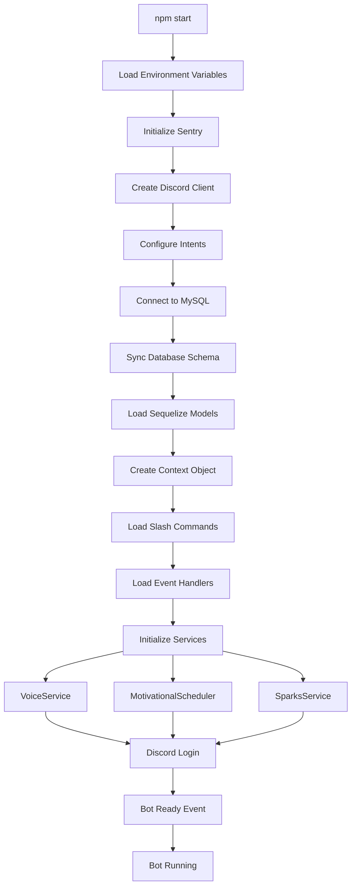
```mermaid
flowchart TD
    START[npm start] --> ENV[Load Environment Variables]
    ENV --> SENTRY[Initialize Sentry]
    SENTRY --> CLIENT[Create Discord Client]
    CLIENT --> INTENTS[Configure Intents]
    INTENTS --> DB[Connect to MySQL]
    DB --> SYNC[Sync Database Schema]
    SYNC --> MODELS[Load Sequelize Models]
    MODELS --> CTX[Create Context Object]
    CTX --> CMDS[Load Slash Commands]
    CMDS --> EVENTS[Load Event Handlers]
    EVENTS --> SERVICES[Initialize Services]
    SERVICES --> VS[VoiceService]
    SERVICES --> MS[MotivationalScheduler]
    SERVICES --> SS[SparksService]
    VS & MS & SS --> LOGIN[Discord Login]
    LOGIN --> READY[Bot Ready Event]
    READY --> RUNNING[Bot Running]
```

### Graceful Shutdown Workflow

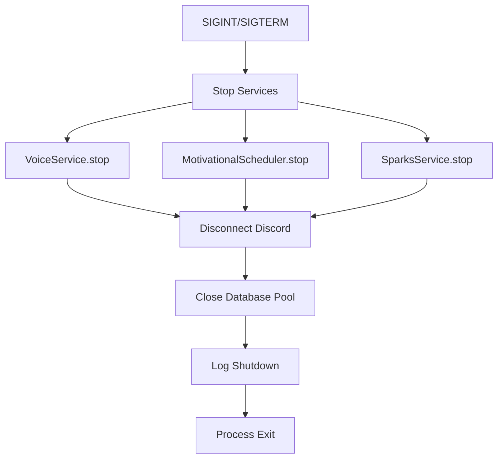
```mermaid
flowchart TD
    SIGNAL[SIGINT/SIGTERM] --> STOP[Stop Services]
    STOP --> VS[VoiceService.stop]
    STOP --> MS[MotivationalScheduler.stop]
    STOP --> SS[SparksService.stop]
    VS & MS & SS --> DISC[Disconnect Discord]
    DISC --> DB[Close Database Pool]
    DB --> LOG[Log Shutdown]
    LOG --> EXIT[Process Exit]
```

## Command Execution Workflows

### Slash Command Flow

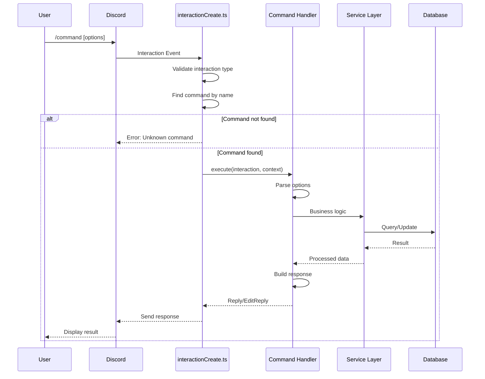
```mermaid
sequenceDiagram
    participant U as User
    participant D as Discord
    participant I as interactionCreate.ts
    participant C as Command Handler
    participant S as Service Layer
    participant DB as Database

    U->>D: /command [options]
    D->>I: Interaction Event
    I->>I: Validate interaction type
    I->>I: Find command by name

    alt Command not found
        I-->>D: Error: Unknown command
    else Command found
        I->>C: execute(interaction, context)
        C->>C: Parse options
        C->>S: Business logic
        S->>DB: Query/Update
        DB-->>S: Result
        S-->>C: Processed data
        C->>C: Build response
        C-->>I: Reply/EditReply
        I-->>D: Send response
        D-->>U: Display result
    end
```

### Autocomplete Flow

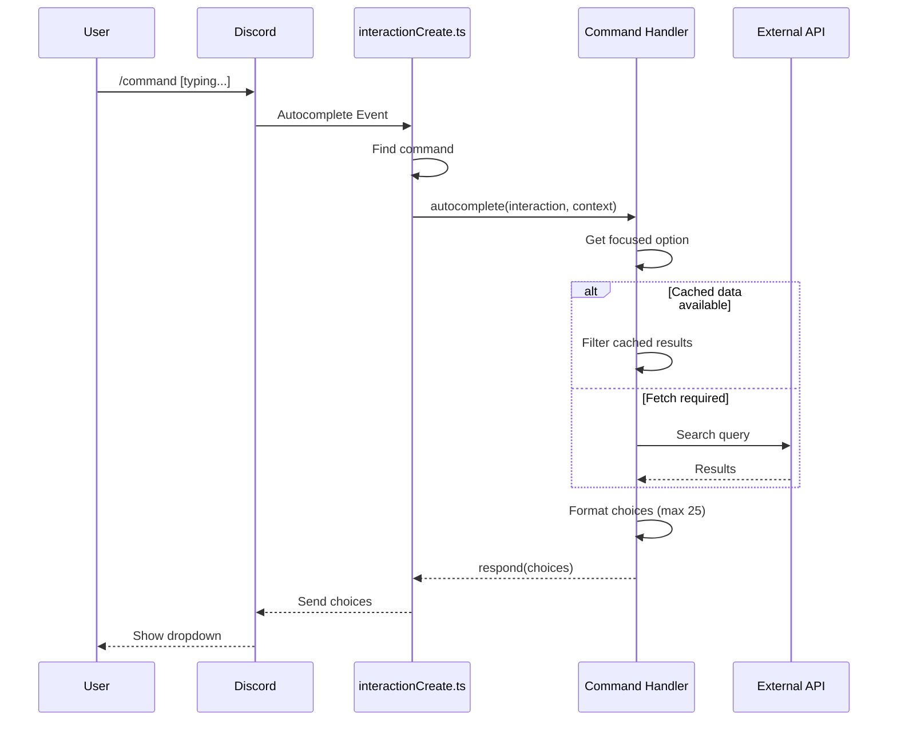
```mermaid
sequenceDiagram
    participant U as User
    participant D as Discord
    participant I as interactionCreate.ts
    participant C as Command Handler
    participant API as External API

    U->>D: /command [typing...]
    D->>I: Autocomplete Event
    I->>I: Find command
    I->>C: autocomplete(interaction, context)
    C->>C: Get focused option

    alt Cached data available
        C->>C: Filter cached results
    else Fetch required
        C->>API: Search query
        API-->>C: Results
    end

    C->>C: Format choices (max 25)
    C-->>I: respond(choices)
    I-->>D: Send choices
    D-->>U: Show dropdown
```

## Message Response Workflow

### Priority-Based Response Processing

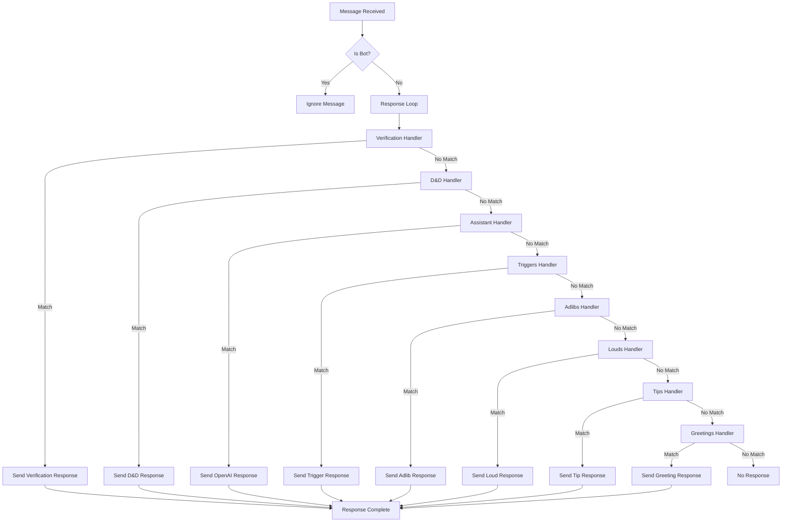
```mermaid
flowchart TD
    MSG[Message Received] --> BOT{Is Bot?}
    BOT -->|Yes| IGNORE[Ignore Message]
    BOT -->|No| LOOP[Response Loop]

    LOOP --> V[Verification Handler]
    V -->|Match| VR[Send Verification Response]
    V -->|No Match| DND[D&D Handler]

    DND -->|Match| DR[Send D&D Response]
    DND -->|No Match| AST[Assistant Handler]

    AST -->|Match| AR[Send OpenAI Response]
    AST -->|No Match| TRG[Triggers Handler]

    TRG -->|Match| TR[Send Trigger Response]
    TRG -->|No Match| ADL[Adlibs Handler]

    ADL -->|Match| ALR[Send Adlib Response]
    ADL -->|No Match| LUD[Louds Handler]

    LUD -->|Match| LR[Send Loud Response]
    LUD -->|No Match| TIP[Tips Handler]

    TIP -->|Match| TPR[Send Tip Response]
    TIP -->|No Match| GRT[Greetings Handler]

    GRT -->|Match| GR[Send Greeting Response]
    GRT -->|No Match| END[No Response]

    VR & DR & AR & TR & ALR & LR & TPR & GR --> DONE[Response Complete]
```

### NLP Assistant Classification Flow

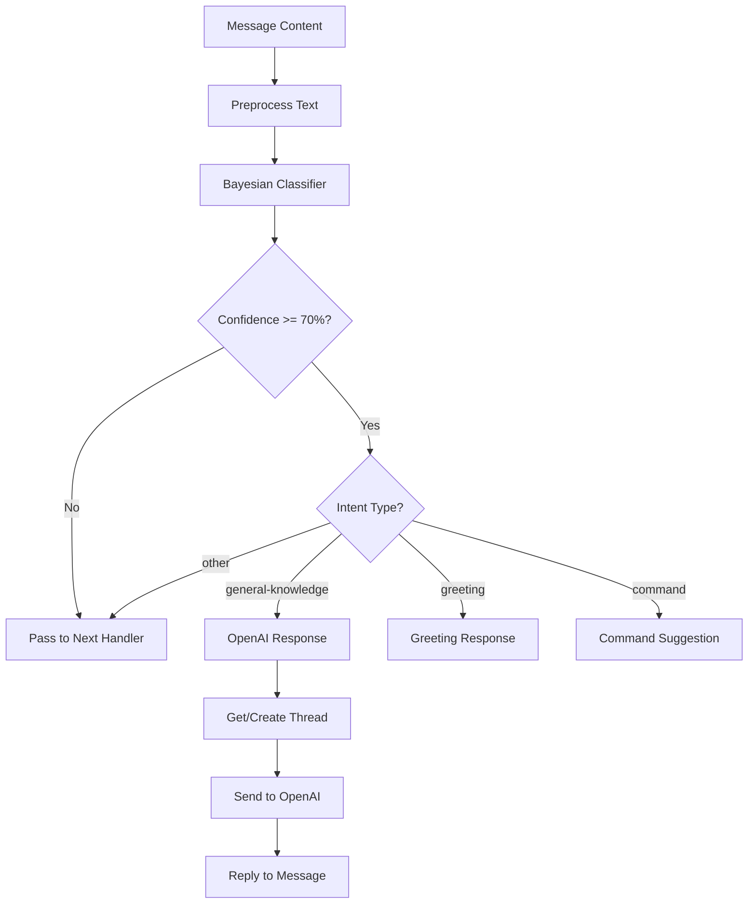
```mermaid
flowchart TD
    MSG[Message Content] --> PRE[Preprocess Text]
    PRE --> BAYES[Bayesian Classifier]
    BAYES --> CONF{Confidence >= 70%?}

    CONF -->|No| SKIP[Pass to Next Handler]
    CONF -->|Yes| INTENT{Intent Type?}

    INTENT -->|general-knowledge| GK[OpenAI Response]
    INTENT -->|greeting| GR[Greeting Response]
    INTENT -->|command| CMD[Command Suggestion]
    INTENT -->|other| SKIP

    GK --> THREAD[Get/Create Thread]
    THREAD --> OAI[Send to OpenAI]
    OAI --> REPLY[Reply to Message]
```

## Voice Workflow

### Text-to-Speech Flow

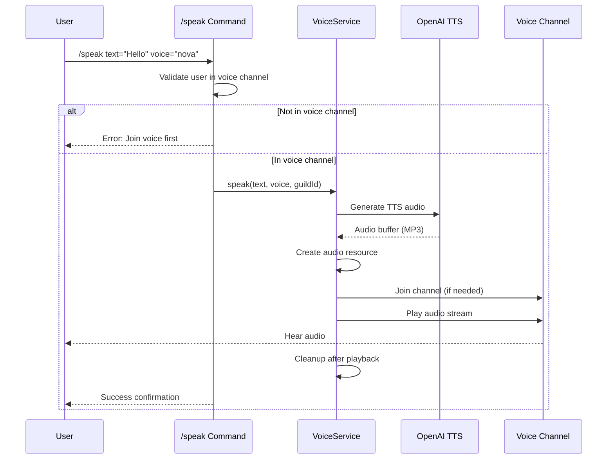
```mermaid
sequenceDiagram
    participant U as User
    participant CMD as /speak Command
    participant VS as VoiceService
    participant OAI as OpenAI TTS
    participant VC as Voice Channel

    U->>CMD: /speak text="Hello" voice="nova"
    CMD->>CMD: Validate user in voice channel

    alt Not in voice channel
        CMD-->>U: Error: Join voice first
    else In voice channel
        CMD->>VS: speak(text, voice, guildId)
        VS->>OAI: Generate TTS audio
        OAI-->>VS: Audio buffer (MP3)
        VS->>VS: Create audio resource
        VS->>VC: Join channel (if needed)
        VS->>VC: Play audio stream
        VC-->>U: Hear audio
        VS->>VS: Cleanup after playback
        CMD-->>U: Success confirmation
    end
```

### Voice Connection Lifecycle

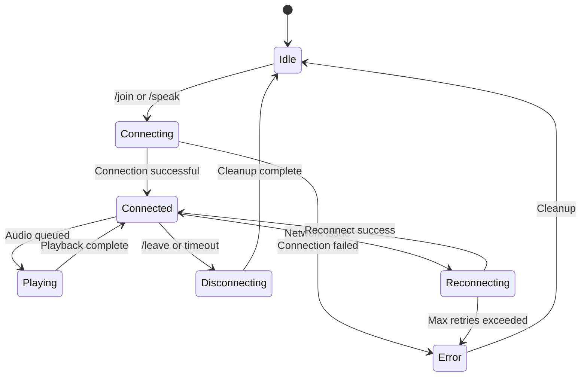
```mermaid
stateDiagram-v2
    [*] --> Idle
    Idle --> Connecting: /join or /speak
    Connecting --> Connected: Connection successful
    Connecting --> Error: Connection failed
    Error --> Idle: Cleanup
    Connected --> Playing: Audio queued
    Playing --> Connected: Playback complete
    Connected --> Disconnecting: /leave or timeout
    Disconnecting --> Idle: Cleanup complete
    Connected --> Reconnecting: Network issue
    Reconnecting --> Connected: Reconnect success
    Reconnecting --> Error: Max retries exceeded
```

## Database Workflows

### Transaction Flow (Sparks Economy)

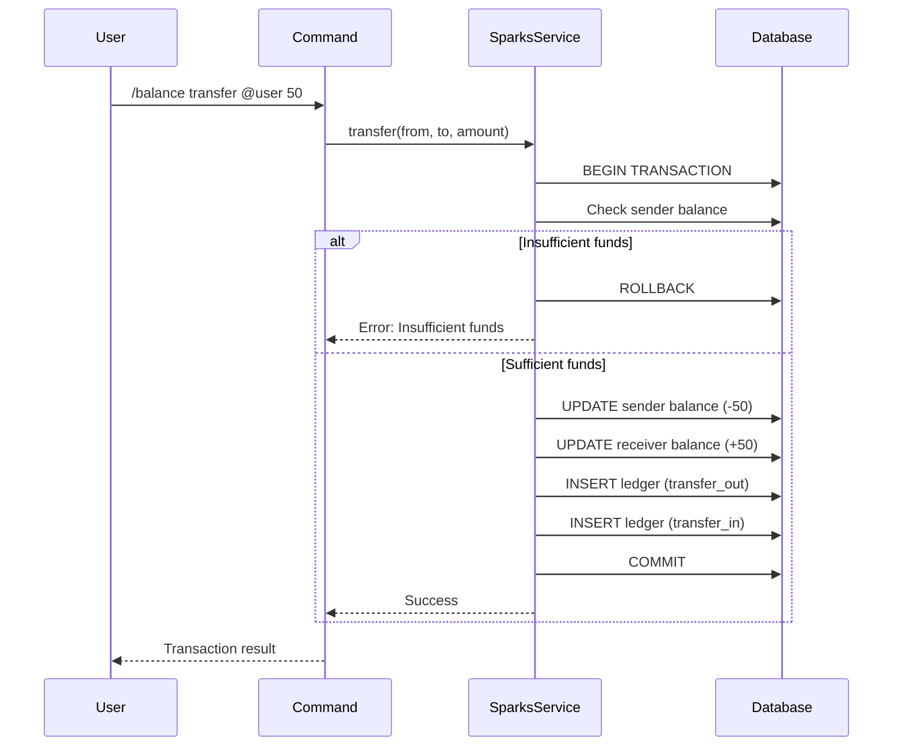
```mermaid
sequenceDiagram
    participant U as User
    participant CMD as Command
    participant SS as SparksService
    participant DB as Database

    U->>CMD: /balance transfer @user 50
    CMD->>SS: transfer(from, to, amount)
    SS->>DB: BEGIN TRANSACTION
    SS->>DB: Check sender balance

    alt Insufficient funds
        SS->>DB: ROLLBACK
        SS-->>CMD: Error: Insufficient funds
    else Sufficient funds
        SS->>DB: UPDATE sender balance (-50)
        SS->>DB: UPDATE receiver balance (+50)
        SS->>DB: INSERT ledger (transfer_out)
        SS->>DB: INSERT ledger (transfer_in)
        SS->>DB: COMMIT
        SS-->>CMD: Success
    end

    CMD-->>U: Transaction result
```

### Migration Workflow

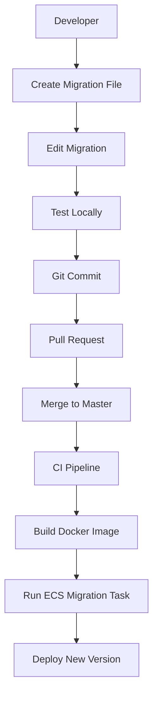
```mermaid
flowchart TD
    DEV[Developer] --> CREATE[Create Migration File]
    CREATE --> EDIT[Edit Migration]
    EDIT --> TEST[Test Locally]
    TEST --> COMMIT[Git Commit]
    COMMIT --> PR[Pull Request]
    PR --> MERGE[Merge to Master]
    MERGE --> CI[CI Pipeline]
    CI --> BUILD[Build Docker Image]
    BUILD --> MIGRATE[Run ECS Migration Task]
    MIGRATE --> DEPLOY[Deploy New Version]
```

## Polling Workflow

### Poll Creation and Voting

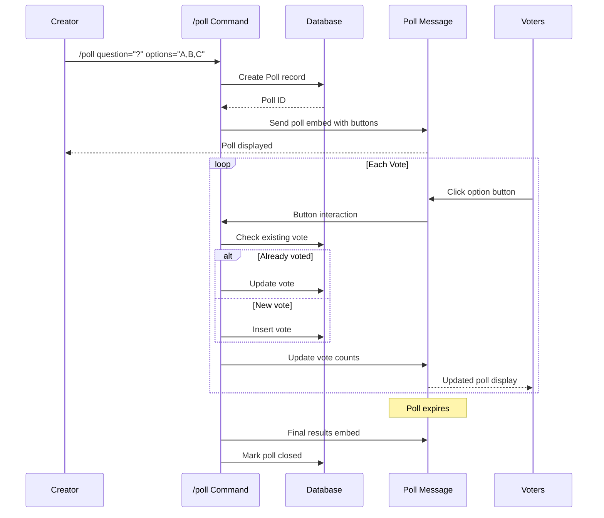
```mermaid
sequenceDiagram
    participant C as Creator
    participant CMD as /poll Command
    participant DB as Database
    participant M as Poll Message
    participant V as Voters

    C->>CMD: /poll question="?" options="A,B,C"
    CMD->>DB: Create Poll record
    DB-->>CMD: Poll ID
    CMD->>M: Send poll embed with buttons
    M-->>C: Poll displayed

    loop Each Vote
        V->>M: Click option button
        M->>CMD: Button interaction
        CMD->>DB: Check existing vote
        alt Already voted
            CMD->>DB: Update vote
        else New vote
            CMD->>DB: Insert vote
        end
        CMD->>M: Update vote counts
        M-->>V: Updated poll display
    end

    Note over M: Poll expires
    CMD->>M: Final results embed
    CMD->>DB: Mark poll closed
```

## Scheduled Event Workflow

### Motivational Quote Scheduling

```mermaid
flowchart TD
    CONFIG[/motivational-config] --> SAVE[Save to Database]
    SAVE --> SCHED[Schedule Cron Job]
    SCHED --> WAIT[Wait for Trigger]
    WAIT --> TRIGGER[Cron Triggers]
    TRIGGER --> GEN[Generate Quote]
    GEN --> SEND[Send to Channel]
    SEND --> WAIT

    STOP[Bot Shutdown] --> CANCEL[Cancel All Jobs]
    RESTART[Bot Restart] --> LOAD[Load Active Configs]
    LOAD --> RESCHED[Reschedule Jobs]
    RESCHED --> WAIT
```

### Reminder Workflow

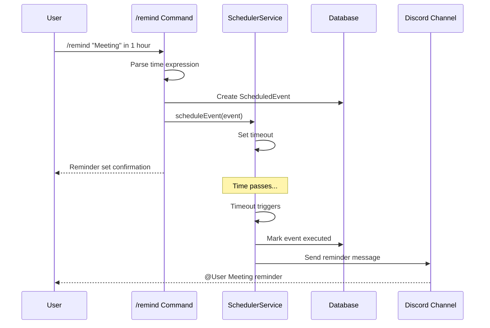
```mermaid
sequenceDiagram
    participant U as User
    participant CMD as /remind Command
    participant SS as SchedulerService
    participant DB as Database
    participant CH as Discord Channel

    U->>CMD: /remind "Meeting" in 1 hour
    CMD->>CMD: Parse time expression
    CMD->>DB: Create ScheduledEvent
    CMD->>SS: scheduleEvent(event)
    SS->>SS: Set timeout
    CMD-->>U: Reminder set confirmation

    Note over SS: Time passes...

    SS->>SS: Timeout triggers
    SS->>DB: Mark event executed
    SS->>CH: Send reminder message
    CH-->>U: @User Meeting reminder
```

## CI/CD Workflow

### Pull Request Pipeline

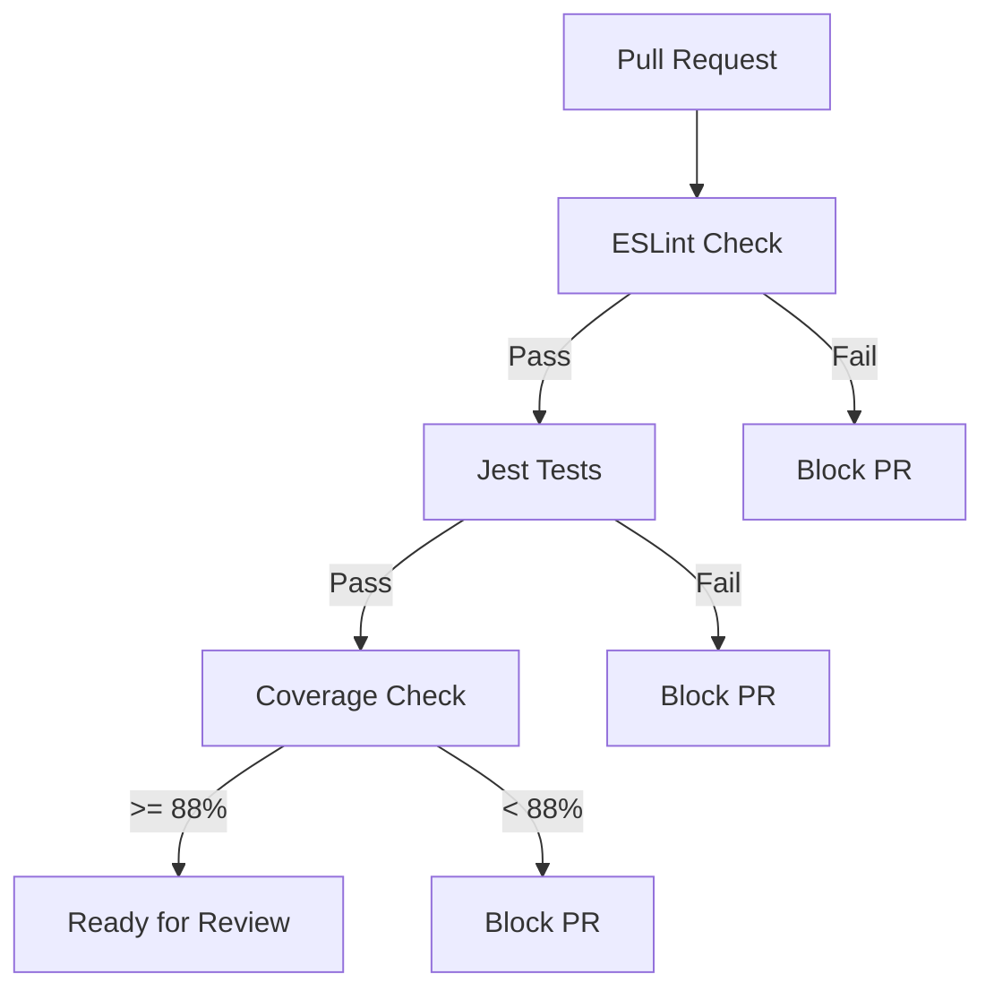
```mermaid
flowchart TD
    PR[Pull Request] --> LINT[ESLint Check]
    LINT -->|Pass| TEST[Jest Tests]
    LINT -->|Fail| FAIL1[Block PR]
    TEST -->|Pass| COV[Coverage Check]
    TEST -->|Fail| FAIL2[Block PR]
    COV -->|>= 88%| APPROVE[Ready for Review]
    COV -->|< 88%| FAIL3[Block PR]
```

### Release Pipeline

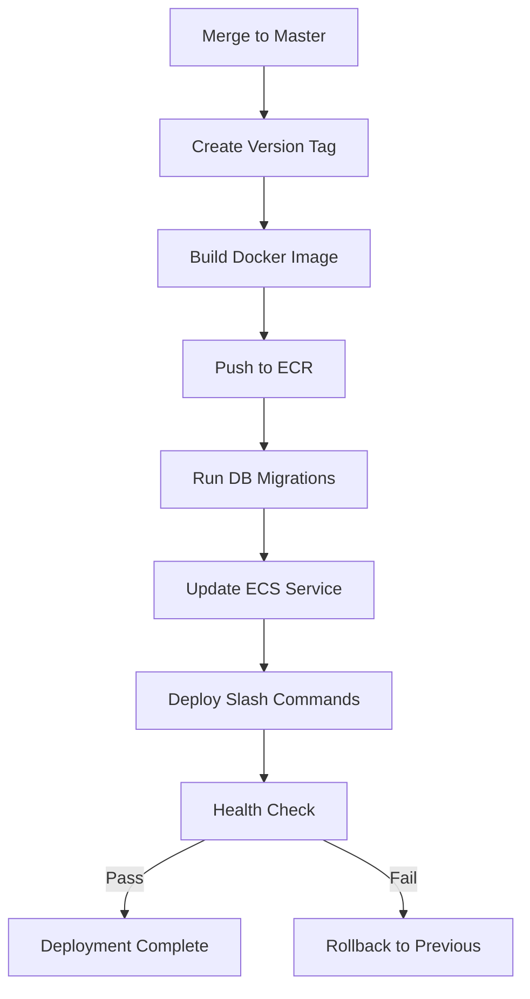
```mermaid
flowchart TD
    MERGE[Merge to Master] --> TAG[Create Version Tag]
    TAG --> BUILD[Build Docker Image]
    BUILD --> PUSH[Push to ECR]
    PUSH --> MIGRATE[Run DB Migrations]
    MIGRATE --> DEPLOY[Update ECS Service]
    DEPLOY --> CMDS[Deploy Slash Commands]
    CMDS --> VERIFY[Health Check]
    VERIFY -->|Pass| DONE[Deployment Complete]
    VERIFY -->|Fail| ROLLBACK[Rollback to Previous]
```

## Error Handling Workflow

### Error Capture and Reporting

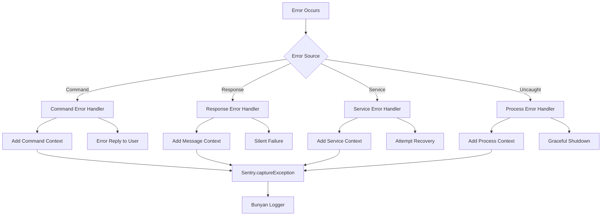
```mermaid
flowchart TD
    ERR[Error Occurs] --> TYPE{Error Source}

    TYPE -->|Command| CE[Command Error Handler]
    TYPE -->|Response| RE[Response Error Handler]
    TYPE -->|Service| SE[Service Error Handler]
    TYPE -->|Uncaught| UE[Process Error Handler]

    CE --> CTX1[Add Command Context]
    RE --> CTX2[Add Message Context]
    SE --> CTX3[Add Service Context]
    UE --> CTX4[Add Process Context]

    CTX1 & CTX2 & CTX3 & CTX4 --> SENTRY[Sentry.captureException]
    SENTRY --> LOG[Bunyan Logger]

    CE --> REPLY[Error Reply to User]
    RE --> SILENT[Silent Failure]
    SE --> RECOVER[Attempt Recovery]
    UE --> SHUTDOWN[Graceful Shutdown]
```

## Gaming Workflows

### D&D Game Flow

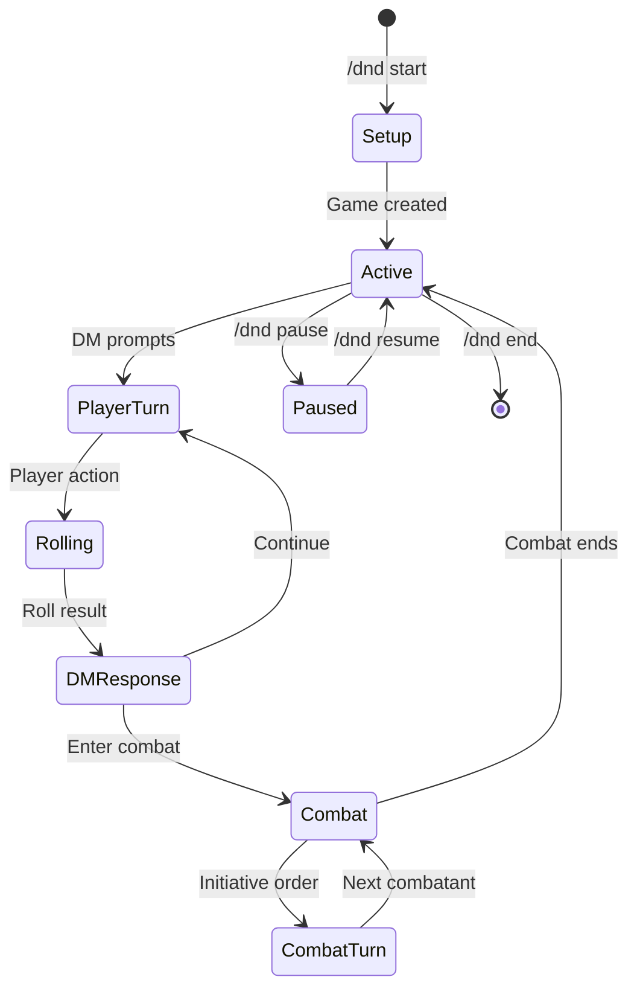
```mermaid
stateDiagram-v2
    [*] --> Setup: /dnd start
    Setup --> Active: Game created
    Active --> PlayerTurn: DM prompts
    PlayerTurn --> Rolling: Player action
    Rolling --> DMResponse: Roll result
    DMResponse --> PlayerTurn: Continue
    DMResponse --> Combat: Enter combat
    Combat --> CombatTurn: Initiative order
    CombatTurn --> Combat: Next combatant
    Combat --> Active: Combat ends
    Active --> Paused: /dnd pause
    Paused --> Active: /dnd resume
    Active --> [*]: /dnd end
```

### Arc Raiders Item Lookup

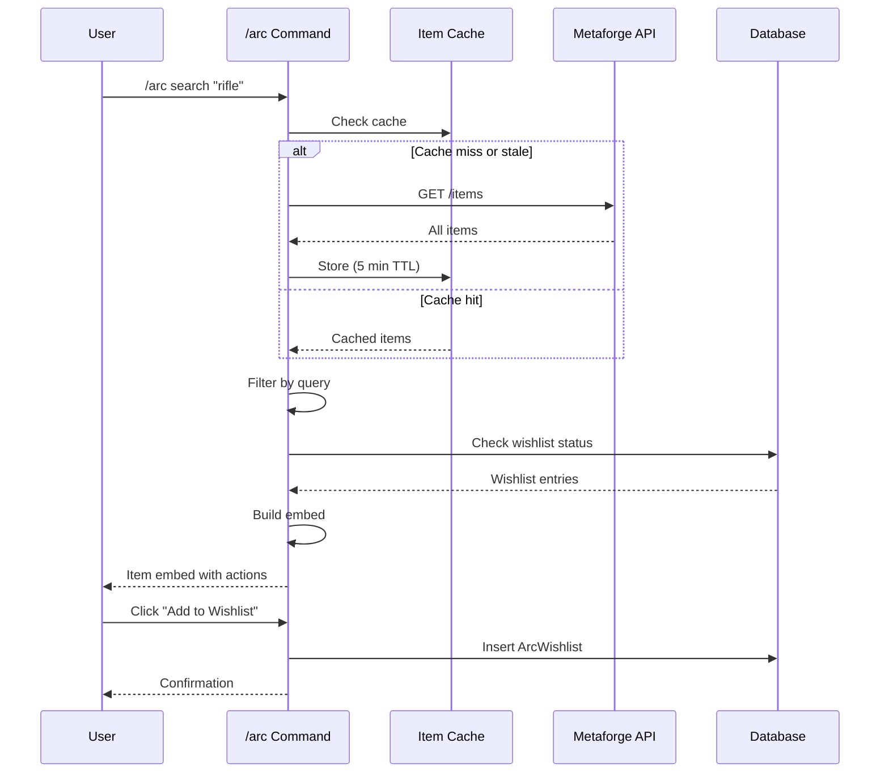
```mermaid
sequenceDiagram
    participant U as User
    participant CMD as /arc Command
    participant CACHE as Item Cache
    participant API as Metaforge API
    participant DB as Database

    U->>CMD: /arc search "rifle"
    CMD->>CACHE: Check cache

    alt Cache miss or stale
        CMD->>API: GET /items
        API-->>CMD: All items
        CMD->>CACHE: Store (5 min TTL)
    else Cache hit
        CACHE-->>CMD: Cached items
    end

    CMD->>CMD: Filter by query
    CMD->>DB: Check wishlist status
    DB-->>CMD: Wishlist entries
    CMD->>CMD: Build embed
    CMD-->>U: Item embed with actions

    U->>CMD: Click "Add to Wishlist"
    CMD->>DB: Insert ArcWishlist
    CMD-->>U: Confirmation
```
