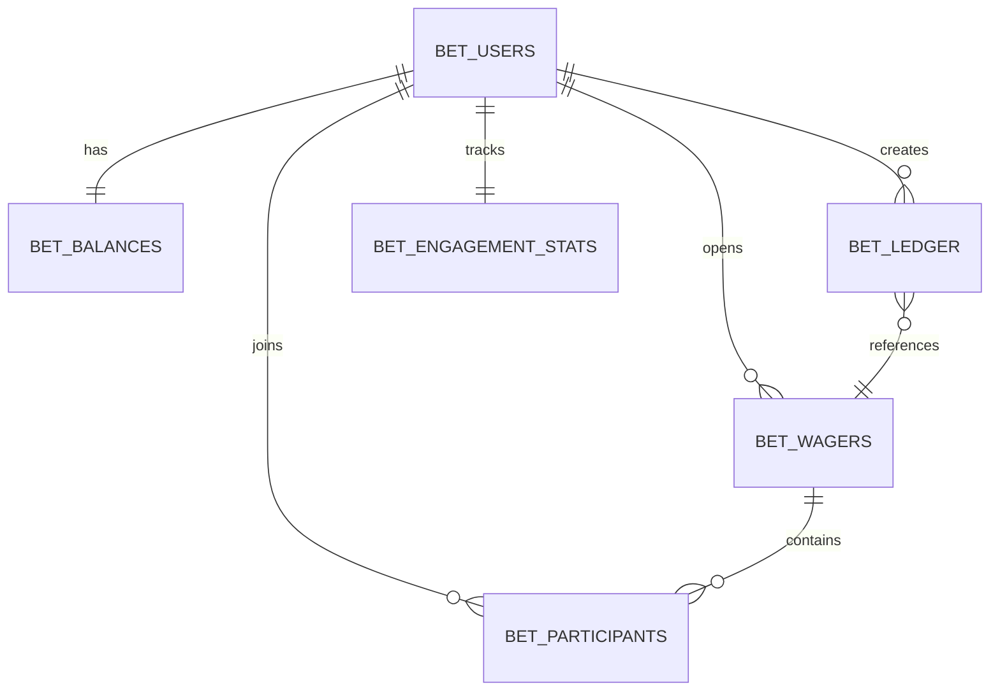

# Data Model: Discord Bot Betting System

**Date**: 2025-09-11  
**Feature**: Discord Bot Engagement Currency & Betting System  

## Entity Relationships



## Core Entities

### BetUsers
**Purpose**: Maps Discord users to betting system with privacy controls

| Field | Type | Constraints | Description |
|-------|------|-------------|-------------|
| id | BIGINT | PRIMARY KEY, AUTO_INCREMENT | Internal user ID |
| discord_id | VARCHAR(255) | UNIQUE NOT NULL | Discord user snowflake ID |
| handle | VARCHAR(255) | | Discord username for display |
| hide_last_seen | BOOLEAN | DEFAULT FALSE | Privacy setting for /lastseen |
| created_at | TIMESTAMP | DEFAULT NOW() | Registration timestamp |

**Validation Rules**:
- discord_id must be valid Discord snowflake format (17-19 digits)
- handle updated on user interaction to reflect current Discord username

### BetBalances  
**Purpose**: User financial state with real-time balance tracking

| Field | Type | Constraints | Description |
|-------|------|-------------|-------------|
| user_id | BIGINT | PRIMARY KEY, FOREIGN KEY | Reference to BetUsers.id |
| current_balance | INTEGER | DEFAULT 100, >= 0 | Available Sparks for spending |
| escrow_balance | INTEGER | DEFAULT 0, >= 0 | Sparks locked in active bets |
| lifetime_earned | INTEGER | DEFAULT 0 | Total Sparks earned historically |
| lifetime_spent | INTEGER | DEFAULT 0 | Total Sparks spent historically |
| updated_at | TIMESTAMP | DEFAULT NOW() | Last balance modification |

**Validation Rules**:
- current_balance + escrow_balance = lifetime_earned - lifetime_spent
- All monetary fields must be non-negative integers
- Balance calculations verified against ledger on each update

### BetLedger
**Purpose**: Complete audit trail of all Spark movements

| Field | Type | Constraints | Description |
|-------|------|-------------|-------------|
| id | BIGSERIAL | PRIMARY KEY | Unique transaction ID |
| user_id | BIGINT | FOREIGN KEY, NOT NULL | Reference to BetUsers.id |
| type | ENUM | NOT NULL | Transaction type (see enum below) |
| amount | INTEGER | NOT NULL, > 0 | Spark amount (always positive) |
| ref_type | VARCHAR(50) | | Reference category (bet, message, bonus) |
| ref_id | VARCHAR(255) | | Reference ID (bet UUID, message ID) |
| meta | JSONB | | Additional context data |
| created_at | TIMESTAMP | DEFAULT NOW() | Transaction timestamp |

**Transaction Types**:
- `earn`: Sparks gained from engagement
- `spend`: Sparks consumed (future expansions)
- `escrow_in`: Sparks moved to bet escrow
- `escrow_out`: Sparks released from escrow  
- `refund`: Bet cancellation refund
- `payout`: Bet win payout
- `void`: Voided bet return

### BetWagers
**Purpose**: Betting markets with odds and settlement tracking

| Field | Type | Constraints | Description |
|-------|------|-------------|-------------|
| id | UUID | PRIMARY KEY, DEFAULT gen_random_uuid() | Unique bet identifier |
| opener_id | BIGINT | FOREIGN KEY, NOT NULL | Reference to BetUsers.id |
| statement | TEXT | NOT NULL, LENGTH <= 200 | Bet description/question |
| odds_for | INTEGER | DEFAULT 1, BETWEEN 1 AND 10 | Odds numerator for "for" side |
| odds_against | INTEGER | DEFAULT 1, BETWEEN 1 AND 10 | Odds numerator for "against" side |
| status | ENUM | DEFAULT 'open' | Bet lifecycle state |
| total_for | INTEGER | DEFAULT 0 | Total Sparks wagered "for" |
| total_against | INTEGER | DEFAULT 0 | Total Sparks wagered "against" |
| opens_at | TIMESTAMP | DEFAULT NOW() | When bet becomes available |
| closes_at | TIMESTAMP | NOT NULL | When betting window closes |
| settled_at | TIMESTAMP | | When moderator settled bet |
| outcome | ENUM | | Final settlement result |
| created_at | TIMESTAMP | DEFAULT NOW() | Bet creation timestamp |

**Status States**: `open`, `closed`, `settled`, `void`  
**Outcome Values**: `for`, `against`, `void`

**Validation Rules**:
- closes_at must be after opens_at
- statement cannot be empty or only whitespace
- Only open bets accept new participants
- Only moderators can change status to settled/void

### BetParticipants
**Purpose**: User participation in specific betting markets

| Field | Type | Constraints | Description |
|-------|------|-------------|-------------|
| id | BIGSERIAL | PRIMARY KEY | Unique participation record |
| bet_id | UUID | FOREIGN KEY, NOT NULL | Reference to BetWagers.id |
| user_id | BIGINT | FOREIGN KEY, NOT NULL | Reference to BetUsers.id |
| side | ENUM | NOT NULL | Betting side choice |
| amount | INTEGER | NOT NULL, > 0 | Sparks wagered |
| joined_at | TIMESTAMP | DEFAULT NOW() | When user joined bet |

**Side Values**: `for`, `against`

**Constraints**:
- UNIQUE(bet_id, user_id, side) - prevents duplicate joins on same side
- Users can join both sides of same bet with separate transactions
- amount must not exceed user's available balance at join time

### BetEngagementStats  
**Purpose**: Anti-abuse tracking for Spark earning eligibility

| Field | Type | Constraints | Description |
|-------|------|-------------|-------------|
| user_id | BIGINT | PRIMARY KEY, FOREIGN KEY | Reference to BetUsers.id |
| message_count | INTEGER | DEFAULT 0 | Total qualifying messages |
| last_message_at | TIMESTAMP | | Most recent message timestamp |
| daily_earn_count | INTEGER | DEFAULT 0 | Today's earning events |
| last_earn_at | TIMESTAMP | | Most recent Spark earning |
| last_reset_date | DATE | DEFAULT CURRENT_DATE | Daily counter reset tracking |

**State Transitions**:
- daily_earn_count resets to 0 when last_reset_date != CURRENT_DATE
- Earning eligibility checked against rate limits and cooldowns
- Spam detection triggers based on message frequency without engagement

## Indexes for Performance

```sql
-- Balance queries (most frequent)
CREATE INDEX idx_balances_user_updated ON bet_balances(user_id, updated_at);

-- Transaction history lookups
CREATE INDEX idx_ledger_user_created ON bet_ledger(user_id, created_at DESC);
CREATE INDEX idx_ledger_ref ON bet_ledger(ref_type, ref_id);

-- Bet browsing and filtering
CREATE INDEX idx_wagers_status_closes ON bet_wagers(status, closes_at);
CREATE INDEX idx_wagers_opener_created ON bet_wagers(opener_id, created_at);

-- Participation tracking
CREATE INDEX idx_participants_bet_side ON bet_participants(bet_id, side);
CREATE INDEX idx_participants_user_joined ON bet_participants(user_id, joined_at);

-- Engagement and anti-abuse
CREATE INDEX idx_engagement_last_message ON bet_engagement_stats(last_message_at);
CREATE INDEX idx_engagement_daily_reset ON bet_engagement_stats(last_reset_date, daily_earn_count);
```

## Data Integrity Rules

### Balance Consistency
```sql
-- Trigger to maintain balance consistency
CREATE TRIGGER verify_balance_consistency 
AFTER UPDATE ON bet_balances
FOR EACH ROW
BEGIN
    DECLARE ledger_total INTEGER;
    SELECT COALESCE(SUM(CASE WHEN type IN ('earn', 'payout', 'refund') THEN amount ELSE -amount END), 0)
    INTO ledger_total
    FROM bet_ledger 
    WHERE user_id = NEW.user_id;
    
    IF NEW.lifetime_earned - NEW.lifetime_spent != ledger_total THEN
        SIGNAL SQLSTATE '45000' SET MESSAGE_TEXT = 'Balance inconsistency detected';
    END IF;
END;
```

### Bet State Validation
```sql
-- Check constraint for bet state transitions
ALTER TABLE bet_wagers ADD CONSTRAINT check_settlement_logic
CHECK (
    (status = 'settled' AND outcome IS NOT NULL AND settled_at IS NOT NULL) OR
    (status != 'settled' AND outcome IS NULL)
);
```

## Migration Strategy

### Phase 1: Core Tables
1. Create BetUsers, BetBalances, BetLedger
2. Import existing Discord users with 100 starting Sparks
3. Test balance operations and transaction logging

### Phase 2: Betting System  
1. Create BetWagers, BetParticipants
2. Add foreign key constraints and indexes
3. Test bet creation and joining workflows

### Phase 3: Anti-Abuse
1. Create BetEngagementStats
2. Implement rate limiting triggers
3. Test engagement earning and spam detection